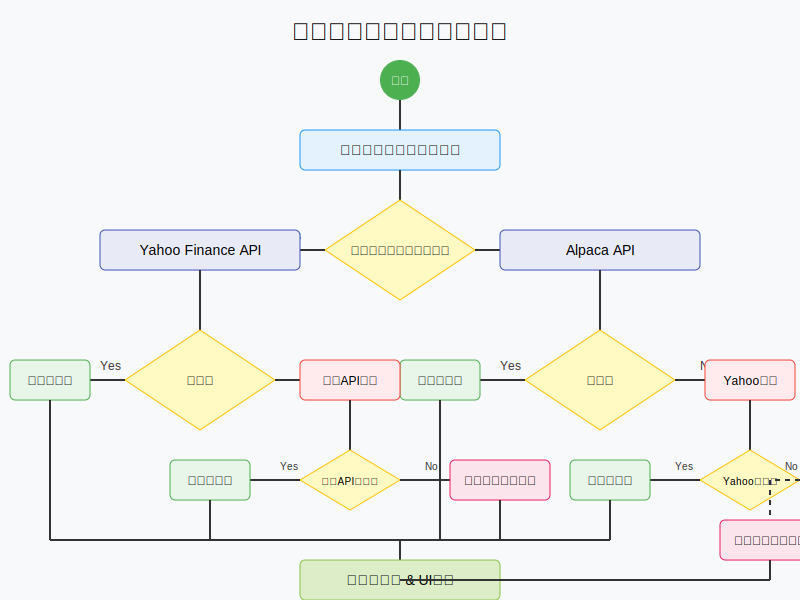

# ポートフォリオ管理アプリケーション

## 概要

このアプリケーションは投資ポートフォリオを管理するためのツールです。複数のデータソースから株価情報を取得し、資産配分の視覚化、リバランス計算、手数料・配当の分析などの機能を提供します。

### システムのURL

https://67d346c75b27c43ae961a2e5--harmonious-malasada-138c4d.netlify.app/

### システムの画面


## 株価データ取得システム

### 概要

このシステムは複数のデータソースを組み合わせて株価情報を効率的かつ信頼性高く取得します。銘柄タイプに応じて最適なデータ取得方法を選択し、主要ソースが失敗した場合は代替ソースを試行する堅牢な仕組みを採用しています。米国の株式については比較的高い精度で株価を取得できますが、日本のAPIを提供している証券会社の証券口座をもっておらず、利用できるAPIがないため、日本の株式については正確に取得できていません。購入株数計算の使い勝手も、試していないのでよくないかもしれません。

### 処理フロー図



### 主な機能

1. **銘柄タイプの自動判定**
   - 投資信託: 7-8桁数字+C形式のコードを検出
   - 日本株: 4桁数字の証券コードを検出
   - 米国株: それ以外のティッカーシンボル

2. **マルチソースデータ取得**
   - 米国株: Alpaca API（プライマリソース）
   - 日本株: スクレイピング（複数サイトから自動取得）
     - Yahoo Finance Japan
     - Minkabu
     - Kabutan
   - 投資信託: スクレイピング（複数サイトから自動取得）
     - Yahoo Finance Japan
     - 投資信託協会
     - Morningstar Japan
     - Minkabu
   - バックアップ: Yahoo Finance API（すべての銘柄タイプに対応）

3. **フォールバックメカニズム**
   - スクレイピングが失敗した場合はバックアップAPIを試行
   - すべてのAPIが失敗した場合は前回値または合理的なデフォルト値を使用
   - ユーザーへの明示的な通知

4. **データの拡張**
   - 手数料率の自動推定
   - 配当情報の取得と推定
   - 銘柄タイプと属性の分析
   - データソースの明示的表示

## インストール方法

```bash
# 依存パッケージのインストール
npm install

# スクレイピング用パッケージのインストール
npm install cheerio axios

# 開発サーバーの起動
npm start

# ビルド
npm run build
```

## 環境変数の設定

`.env`ファイルを作成し、以下の環境変数を設定します。

```
# Google OAuth認証用
REACT_APP_GOOGLE_CLIENT_ID=あなたのGoogleクライアントID
REACT_APP_GOOGLE_API_KEY=あなたのGoogle APIキー

# Alpaca API（米国株データ取得用）
ALPACA_API_KEY=あなたのAlpaca APIキー
ALPACA_API_SECRET=あなたのAlpaca APIシークレット

# スクレイピングのタイムアウト設定
JP_STOCK_SCRAPING_TIMEOUT=20000
MUTUAL_FUND_SCRAPING_TIMEOUT=20000

# デフォルト為替レート（API障害時のフォールバック用）
DEFAULT_EXCHANGE_RATE=150.0
```

## API関連の設定

API呼び出しはNetlifyの関数を通じて行われます。`netlify.toml`ファイルで以下の設定が定義されています：

```toml
[[redirects]]
  from = "/api/*"
  to = "/.netlify/functions/:splat"
  status = 200
  force = true
```

## 既知のバグと制限事項

1. **スクレイピングの不安定性**
   - 対象サイトの構造変更によりスクレイピングが失敗する可能性がある
   - 一部サイトではアクセス制限やCAPTCHAによりデータ取得が困難になることがある
   - 過度な頻度でのデータ更新はIPブロックを引き起こす可能性がある

2. **API制限による取得エラー**
   - Alpha Vantage APIの無料プランでは1分間に5リクエスト、1日に500リクエストという制限あり
   - 多数の銘柄を一度に更新する際にエラーが発生する可能性あり
   - Alpaca APIの無料プランでは米国株のみ対応

3. **データソースの鮮度と精度**
   - 無料APIとスクレイピングのため、データの更新頻度に制限あり
   - 特に日本株・投資信託のデータはリアルタイム性が低い場合あり
   - フォールバック値を使用した場合は実際の市場価格と大きく乖離する可能性あり

4. **サイト構造変更リスク**
   - スクレイピング対象サイトの構造変更時にデータ取得ができなくなる可能性あり
   - 定期的なメンテナンスが必要
   - Yahoo Finance APIへのフォールバックで一時的な対応は可能

## 今後の開発予定

1. 保有資産の時系列データ保存と可視化
2. パフォーマンス分析機能の強化
3. より多くのデータソースのサポート
   - スクレイピングの堅牢性向上
   - 公式APIの採用（利用可能になった場合）
4. UI/UXの改善
5. スクレイピングの長期安定性確保
   - サイト構造変更検知システム
   - ユーザー主導の小規模アップデート機能

## 貢献方法

1. このリポジトリをフォーク
2. 新しいブランチを作成 (`git checkout -b feature/amazing-feature`)
3. 変更をコミット (`git commit -m 'Add some amazing feature'`)
4. ブランチにプッシュ (`git push origin feature/amazing-feature`)
5. プルリクエストを作成

## 免責事項

本アプリケーションの利用に関しては、以下の点にご留意ください：

1. **投資判断について**
   - 本アプリケーションで提供される情報は、投資判断の参考として提供されるものであり、投資アドバイスではありません
   - すべての投資判断は利用者自身の責任において行ってください
   - 投資は元本を保証するものではなく、市場の変動により損失が生じる可能性があります

2. **データの信頼性**
   - 本アプリケーションが提供する株価、為替レート、配当情報などのデータは、第三者のAPIやウェブサイトからスクレイピングにより取得しており、その正確性・完全性・最新性を保証するものではありません
   - 特に無料APIの制限やスクレイピングの不安定性により、一部データが最新でない場合や、フォールバック値（推定値）が使用される場合があります
   - 重要な投資判断を行う際は、正規の金融情報サービスや証券会社の情報を確認することを強く推奨します

3. **スクレイピングに関する制約**
   - 本アプリケーションは一部データをウェブサイトからのスクレイピングにより取得しています
   - スクレイピングは対象サイトの構造変更に脆弱であり、予告なくデータ取得が不可能になる場合があります
   - 対象サイトの利用規約に違反しないよう適切な頻度でのみデータ更新を行ってください

4. **アプリケーションの使用**
   - 本アプリケーションの使用はユーザー自身の責任において行ってください
   - アプリケーションの不具合、予期せぬ動作、データ喪失などにより生じた損害について、開発者は一切の責任を負いません
   - アプリケーションの使用により直接的または間接的に発生したいかなる損失や損害についても、開発者は責任を負いません

5. **専門家への相談**
   - 投資に関する決定を行う前に、必要に応じて資格を持つ財務アドバイザーや証券会社などの専門家に相談することをお勧めします

6. **法的制限**
   - 本アプリケーションの利用は、各ユーザーが所在する国や地域の法律・規制に準拠する必要があります
   - 一部の国や地域では投資関連サービスに特定の制限がある場合があります

7. **継続的サポート**
   - 本アプリケーションの継続的な保守や更新は保証されません
   - APIの変更やスクレイピング対象サイトの構造変更により、機能が制限される可能性があります

本アプリケーションを使用することで、上記の免責事項に同意したものとみなされます。

## ライセンス

このプロジェクトは MIT ライセンスの下で公開されています。
