# PortfolioWise - スマート投資ポートフォリオ管理アプリケーション

## すぐに試せる！AIを活用した投資分析

**PortfolioWise**の最大の強みは、**あなたの投資ポートフォリオデータを自動的にAI分析用のプロンプトに変換する機能**です。

**試してみませんか？** [こちらのサンプルプロンプト](./document/frontend/sample-prompt.md)をClaudeやGemini ChatGPTなどのAIに貼り付けるだけで、このアプリが目指している投資分析がどのようなものか確認できます。実際に使用する際は、プロンプト内の「現在の総資産額」と「毎月の新規投資予定額」の数値を自分の状況に合わせて変更するだけで、あなた専用の投資分析が即座に得られます。

### AIの選択条件と「Claude推奨」の理由

**重要**: 投資分析には**リアルタイムにWEB検索を利用できるAI**の使用を強く推奨します。これにより、最新の市場データと経済ニュースに基づいた正確な分析が可能になります。

**PortfolioWise**の投資分析プロンプトは**Claude AI**との相性が最も良く、最高の分析結果を得るために推奨していますが、ChatGPT（GPT-4o）やGeminiなど、WEB検索機能を備えた他のAIでも効果的に使用できます：

- **高精度な分析能力**: Claudeは複雑な投資データの相互関係や市場変動の影響を正確に分析できます
- **長いコンテキスト保持**: ポートフォリオデータを含む大量のプロンプト情報を保持したまま分析できるため、データの欠落なく一貫した分析が可能です
- **対話的な分析**: わからない点や追加で調べて欲しいポイントをどんどん質問でき、自分の疑問点を解決しながら投資判断を深められます
- **投資方針の反映**: あなた独自の投資方針（リスク許容度、投資期間、ESG重視など）を入力すれば、それを踏まえた具体的な投資戦略を立案できます
- **包括的な市場理解**: 最新の経済情勢や地政学的リスクを考慮した分析が可能です
- **わかりやすい出力**: 専門的な分析結果を理解しやすい形式で提供します
- **投資戦略の具体化**: 理想的な資産配分への移行プランを詳細なステップで提案します

### なぜこれが画期的なのか？

効果的なAI分析の最大の障壁は**適切なプロンプト設計**です。AIに有益な分析をしてもらうには：
1. 現在の状況（保有資産、配分率、目標など）を正確に伝える必要があります
2. 何を分析してほしいのかを明確に指示する必要があります

**PortfolioWise**はこの複雑なプロセスを完全に自動化します：
- **あなたの実際のポートフォリオデータ**（保有銘柄、配分率、目標配分など）を自動的に抽出
- 最新の世界情勢や市場動向を考慮した**専門家レベルの投資分析**をリクエストする最適なプロンプトを生成
- 生成されたプロンプトは**Claude（推奨）**をはじめ、ChatGPT、Geminiなどでも使用可能

つまり、あなたは**ボタン1つ**で、あなただけの資産状況に基づいた専門的な投資分析と提案を受け取ることができます。市場の変化があなたの資産に与える影響をすぐに理解し、最適なリバランス戦略を立てられます。

## 日本市場ユーザー向け重要なお知らせ

**注釈**: 開発者が米国在住であるため、現状では日本市場の対応が十分に進んでいません。しかし以下の方法で効果的に活用できます。

日本市場の資産（投資信託やETF）を管理する場合は、同様の値動きをする米国市場の銘柄を代替として入力することで、ほぼ同等の分析が可能です。例えば：
- S&P500に連動する日本の投資信託を持っている場合 → 米国ETFの「VOO」として入力
- 金価格に連動する日本の投資信託を持っている場合 → 米国ETFの「GLD」として入力

### 主要インデックス・資産クラスの日米対応表

| 資産クラス/インデックス | 日本の投資信託例 | 米国ETF（代替入力） | ティッカー | 経費率(%) |
|------------------------|------------------|---------------------|-----------|-----------|
| **米国株式** | <ul><li>eMAXIS Slim 米国株式(S&P500)</li><li>ニッセイ 外国株式インデックスファンド</li></ul> | Vanguard S&P 500 ETF | VOO | 0.03 |
| **全世界株式** | <ul><li>eMAXIS Slim 全世界株式(オール・カントリー)</li><li>楽天・全世界株式インデックス・ファンド</li></ul> | iShares MSCI ACWI ETF | ACWI | 0.32 |
| **新興国株式** | <ul><li>eMAXIS Slim 新興国株式インデックス</li><li>iFree 新興国株式インデックス</li></ul> | Vanguard FTSE Emerging Markets ETF | VWO | 0.08 |
| **日本株式** | <ul><li>eMAXIS Slim 国内株式(TOPIX)</li><li>ニッセイ 日経225インデックスファンド</li></ul> | iShares MSCI Japan ETF | EWJ | 0.50 |
| **先進国株式(除く米国)** | <ul><li>eMAXIS Slim 先進国株式インデックス</li><li>iFree 外国株式インデックス(MSCI-KOKUSAI)</li></ul> | Vanguard FTSE Developed Markets ETF | VEA | 0.05 |
| **米国債券** | <ul><li>eMAXIS Slim 米国債券インデックス</li><li>三菱UFJ 米国債券インデックスファンド</li></ul> | Vanguard Total Bond Market ETF | BND | 0.03 |
| **金(ゴールド)** | <ul><li>三菱UFJ 純金ファンド</li><li>日興グローバル・インフレ連動債券ファンド</li></ul> | SPDR Gold Shares | GLD | 0.40 |
| **不動産(REIT)** | <ul><li>eMAXIS Slim 国内リートインデックス</li><li>三菱UFJ J-REITファンド</li></ul> | Vanguard Real Estate ETF | VNQ | 0.12 |

※経費率は変更される場合があります。最新の情報は各ETFの公式サイトでご確認ください。

## 概要

PortfolioWiseは、投資家のためのスマートなポートフォリオ管理ツールです。複数のデータソースから株価情報を取得し、資産配分の視覚化、リバランス計算、手数料・配当の分析などの包括的な機能を提供します。さらに、**AIプロンプト生成機能**により、あなたの投資ポートフォリオデータを基にした最適なプロンプトを作成し、お好みのAIアシスタント（Claude推奨）で自由に投資分析ができます。通貨に合わせた表示（円/ドル）やデータの自動取得により、投資判断をより簡単かつ正確にサポートします。

## アクセス

**本番環境（固定URL）**: https://portfolio-wise.com  
最新のポートフォリオ管理アプリケーションにいつでもアクセスできます。

## プロジェクト構造

このプロジェクトは**マイクロサービス構造**で、フロントエンドとバックエンドが独立してデプロイ・運用されています：

```
portfolio-manager/
├── frontend/        # 独立したフロントエンドプロジェクト
│   └── webapp/      # React ベースのWebアプリケーション (Cloudflare Pages)
├── backend/         # 独立したバックエンドプロジェクト (AWS Lambda)
├── documents/       # プロジェクトドキュメント
│   ├── monorepo-to-microservices-migration.md
│   └── ...
├── .claude/         # 開発ログとガイド
│   └── logs/        # 技術的解決手順の記録
└── README.md        # このファイル
```

### アーキテクチャの利点 (2025年7月現在)
- ✅ **独立デプロイ**: フロントエンド・バックエンド個別最適化
- ✅ **パフォーマンス**: Lambda パッケージサイズ67%削減 (99.83MB→32MB)  
- ✅ **セキュリティ**: 依存関係分離でReact開発ツールがLambda環境に混入しない
- ✅ **スケーラビリティ**: 各サービス最適な技術スタック選択可能

## 主な機能

### 1. ポートフォリオ管理と分析
- 保有資産と目標配分の視覚化（円グラフ、差分チャート）
- 複数通貨（円/ドル）対応の資産管理
- 銘柄タイプ自動判定（個別株、ETF、インデックスファンド、投資信託）
- 年間手数料率と配当情報の自動計算・表示

### 2. 投資シミュレーション
- 追加投資のシミュレーション計算
- 通貨に応じた購入金額と購入可能株数の表示
- 理想的な資産配分へのリバランス提案

### 3. AIプロンプト生成機能 🆕
- **あなたのデータを活用**: あなた専用の資産データを自動的にプロンプトに組み込み
- **WEB検索対応AI必須**: リアルタイムにWEB検索できるAI（Claude推奨、ChatGPT-4o、Geminiなど）での使用を推奨
- **数値入力だけで実現**: 総資産額と毎月の投資予定額を設定するだけで分析スタート
- **最新情報で分析**: AIが最新の世界情勢や市場動向を調査しながら分析
- **市場変化の影響把握**: 市場の変動があなたの資産に与える影響をリアルタイムで理解
- **リバランス支援**: 理想的な資産配分への移行プランを提案
- **カスタマイズ自由**: 分析の観点や質問内容を自分好みに編集可能
- **専門的な視点**: 資産クラスごとの相関性分析や地域・業種分散など、プロが行うような分析をAIに依頼
- **プライバシー重視**: アプリは一切ユーザーの資産データを保存・管理せず、AIによる分析もユーザー環境で実行されるため、センシティブな資産情報を安全に分析できます

### 4. マルチソースデータ取得
- **バッチAPI**: 複数銘柄を一括取得し、API呼び出しを最小化
- 米国株: Alpaca API（プライマリソース）
- 日本株: 複数のデータソースから情報取得
- 投資信託: 専用APIを使用した自動データ取得
- バックアップ: Yahoo Finance API（すべての銘柄タイプに対応）
- **高度なレート制限対策**: サーキットブレーカー、指数バックオフ、リクエスト重複排除

### 5. クラウド連携
- Googleログインとデータ同期（セッションベース認証）
- すべてのAPI設定はAWSから自動的に取得（セキュリティ強化）
- Googleドライブを使用したクラウドバックアップ
- 複数デバイス間でのポートフォリオデータ共有
- **Cookie ベース認証**: `withCredentials: true` で安全なセッション管理

## バックエンド開発情報

PortfolioWiseのバックエンドシステムは現在、大規模な刷新を行っています。

### バックエンド開発 
バックエンドは**独立したServerlessプロジェクト**として AWS上で稼働中：
- **技術スタック**: AWS Lambda (Node.js 20.x), API Gateway, DynamoDB
- **パッケージ最適化**: 32MB (Lambda制限250MBの13%)
- **Google認証**: 502エラー解決済み、正常動作中
- **稼働状況**: 本番環境で安定稼働中

### 技術的な特徴
- **フロントエンド**: Cloudflare Pagesで高速・安定なホスティング
- **バックエンド**: AWSの完全サーバーレスアーキテクチャで高可用性を実現
- **セキュリティ**: セッションベース認証、CORS設定、データ暗号化により安全性を確保
- **スケーラビリティ**: 自動スケーリングにより利用者数の増加に対応
- **日本市場対応**: 円・ドル両対応、日本の投資信託データ取得にも対応

### 技術スタック
- **フロントエンド**: React 18, TailwindCSS, Recharts, Context API
- **バックエンド**: Node.js, Serverless Framework, AWS Lambda
- **インフラ**: AWS API Gateway, DynamoDB, CloudFormation
- **認証**: Google OAuth 2.0, セッションベース認証
- **ホスティング**: Cloudflare Pages (フロントエンド), AWS (バックエンド)

### テストカバレッジ
プロジェクトは高いテストカバレッジを維持しています：
- **バックエンド**: 複数のサービスで100%カバレッジを達成
- **フロントエンド**: 70-80%のカバレッジ目標を設定し、継続的に改善中
- **テストツール**: Jest, React Testing Library, MSW (Mock Service Worker)

## システムの画面

### ポートフォリオ分析画面
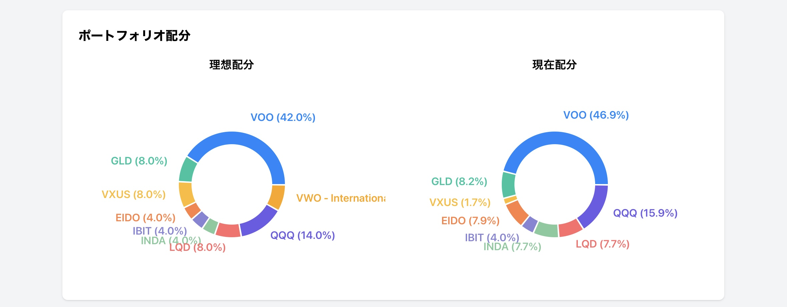

### 資産配分と差分グラフ
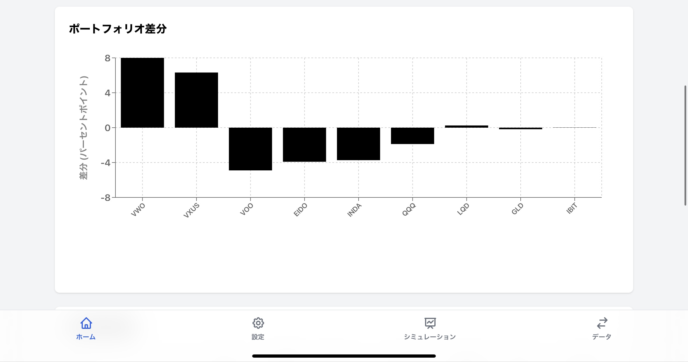

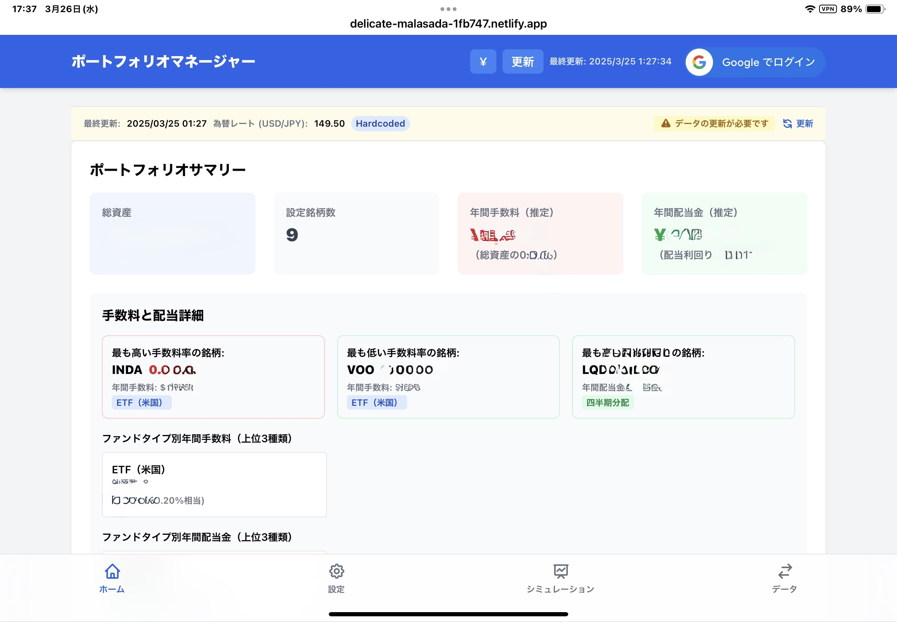
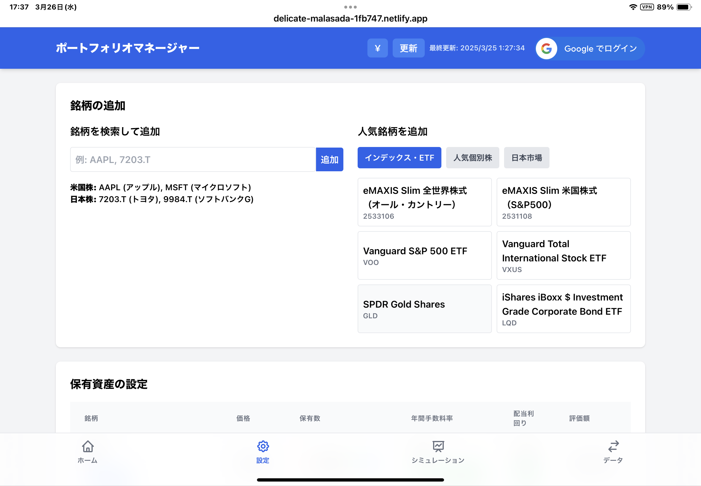
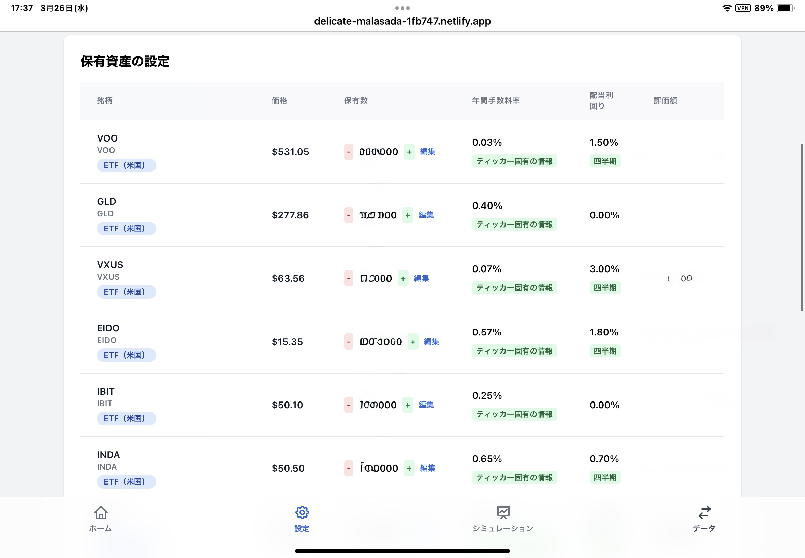
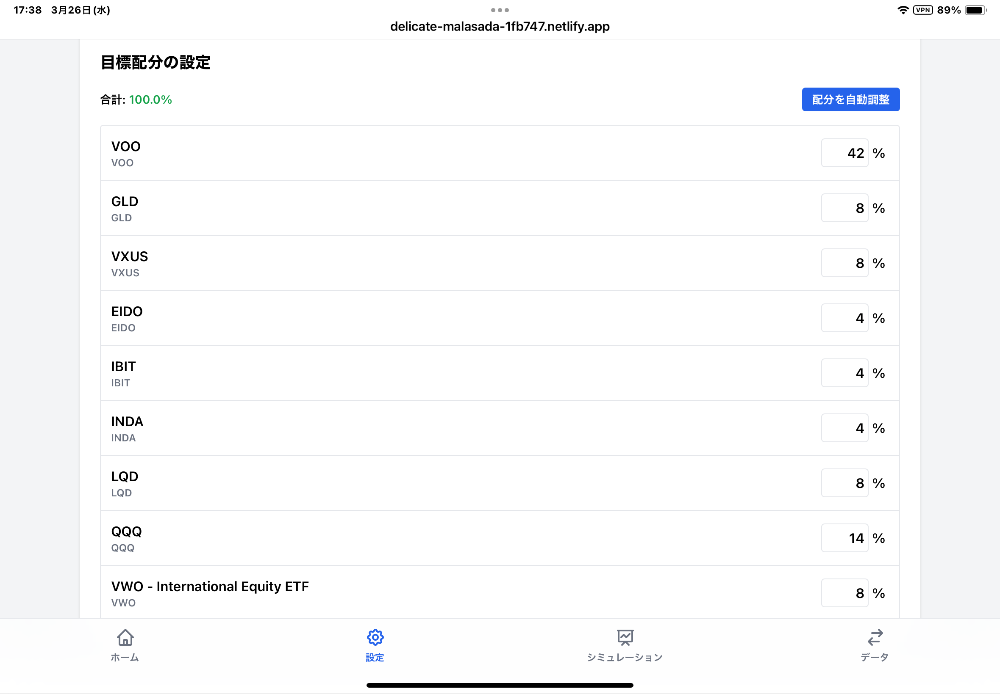
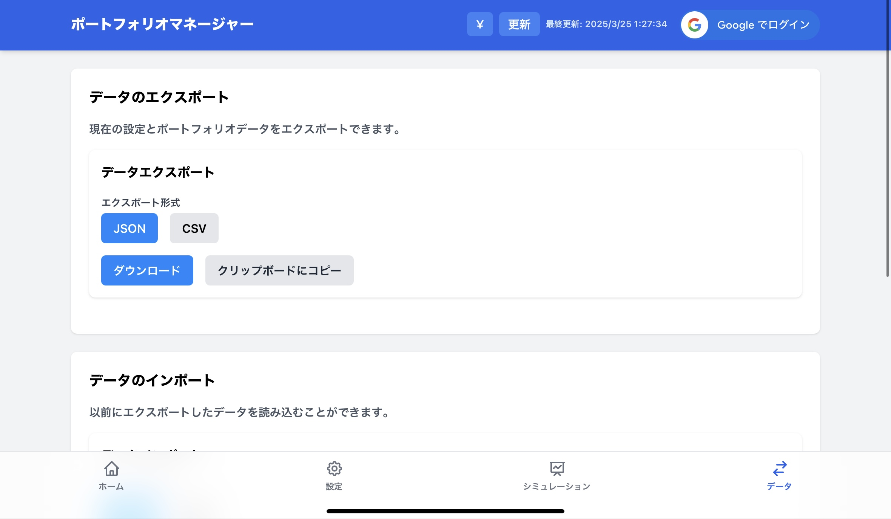
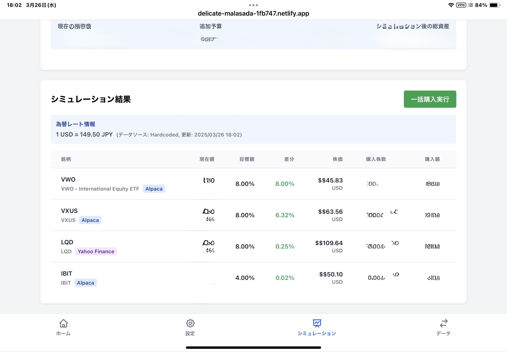

## AIプロンプト生成機能の詳細

新たに実装されたAIプロンプト生成機能は、あなたのポートフォリオデータを活用して、最適な分析プロンプトを生成します。**Claude AI（推奨）との相性が最も良く、最高の分析結果を得られます。** PortfolioWise自体はAI分析を行わず、あなたが好きなAIを使って自由に分析できるようサポートします。この設計には重要な理由があります：アプリがユーザーの資産データを一切保存・管理せず、センシティブな金融情報をアプリ外に送信しないことで、プライバシーとセキュリティを最大限に確保しています。

なお、米国在住の開発者のため日本市場の細かい対応が進んでいませんが、上記の対応表を参考に米国ETFを代替として使用することで、ほぼ同等の分析効果が得られます。例えば、eMAXIS Slim 全世界株式(オール・カントリー)を持っている場合は「ACWI」として入力すると、同様の分析が可能です。

### 特徴とメリット

#### 1. あなただけの資産データを活用
- 現在の資産構成、目標配分、総資産額など、あなた固有のデータをプロンプトに自動組み込み
- あなたの通貨設定（円/ドル）に合わせた金額表示
- 持っている銘柄ごとの情報が自動的に反映

#### 2. 最新情報でリアルタイム分析
- 生成したプロンプトをClaudeに渡すと、AIが最新の市場動向や世界情勢を調査
- 昨日や今週起きた出来事を踏まえた最新の分析が可能
- 常に最新情報を反映した投資判断やリバランス検討ができる

#### 3. 対話型の詳細分析
- わからない点や追加で調べてほしいポイントを自由に質問できる
- 「この銘柄の最新ニュースは？」「セクター別の成長率は？」など疑問を解決しながら進められる
- あなたの投資方針（リスク許容度、投資期間、ESG重視など）を入力すれば、それに合わせた戦略を提案

#### 4. プロ並みの分析視点
- 個別銘柄の将来性だけでなく、ポートフォリオ全体のリスク分散を評価
- 地域分散・セクター分散の分析で偏りを把握
- 短期・中期・長期の投資戦略提案
- 年間手数料や配当利回りを考慮した投資効率分析

#### 5. 自由にカスタマイズ
- デフォルトの分析テンプレートを自分好みに編集可能
- 特に気になる観点（配当、リスク、成長性など）に焦点を当てた分析も可能
- 質問の追加や変更で、より詳細な分析を依頼できる

#### 6. セキュリティとプライバシーの保護
- ユーザーの資産データはアプリ内でのみ処理され、外部サーバーには送信されません
- 金融データを扱うアプリとして最も重要なプライバシー保護を実現
- アプリ自体にAI分析機能を内蔵しないことで、センシティブな資産情報を守りながら高度な分析が可能に

### AIプロンプト生成機能の画面

#### プロンプトコピー画面
ワンクリックであなたのポートフォリオデータを組み込んだプロンプトをコピー。**Claude AI（推奨）**に貼り付けるだけで、あなた専用の投資分析を受け取れます。市場の変化があなたの資産に与える影響を即座に理解し、最適なリバランス戦略を得られます。

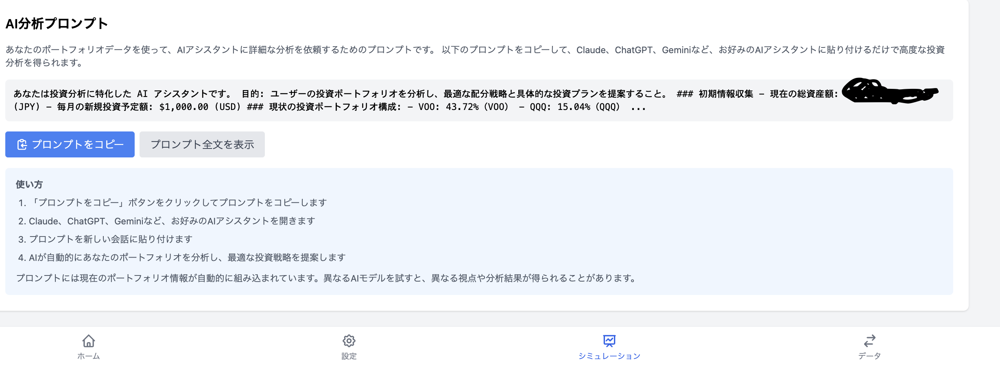

#### プロンプト設定画面
分析の観点や質問内容を自由に編集できる画面です。自分が特に知りたい情報や分析視点を追加できます。

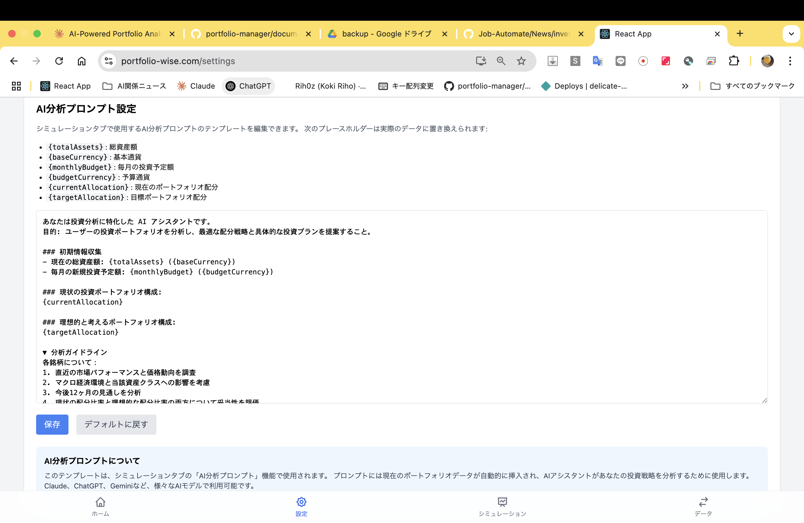

### AIプロンプト実行結果の例

#### 現在の資産配分と理想配分の分析
AIが現在のポートフォリオの状態を詳細に分析し、理想的な資産配分との差異や改善点を提案します。

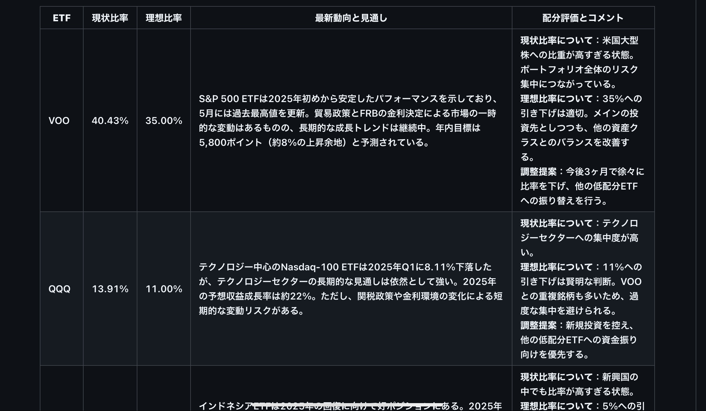

#### 理想配分に近づけるための投資プラン
現在の資産状況から理想的な配分に近づけるための、具体的な銘柄ごとの投資計画を提案します。

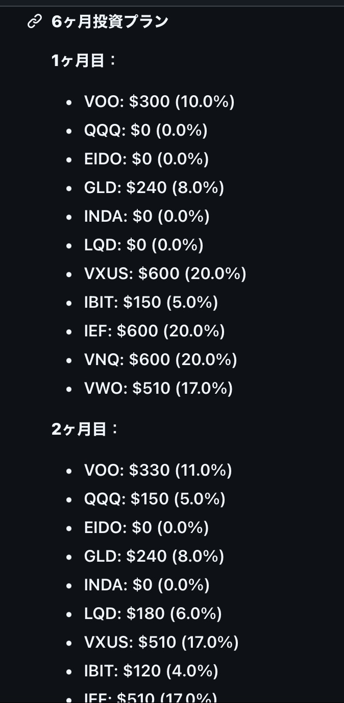

### 使い方（とても簡単です！）
1. シミュレーションタブで「AIプロンプト」セクションを開く
2. 「プロンプトをコピー」ボタンをクリック
3. **リアルタイムWEB検索機能を持つAI**（Claude AI推奨）を開く
4. コピーしたプロンプトを貼り付け、必要に応じて「現在の総資産額」と「毎月の新規投資予定額」の数値だけを変更
5. 送信ボタンをクリック
6. AIが最新の市場情報を検索しながらあなたのポートフォリオを分析し、市場変化の影響とリバランス戦略を提案

**ヒント**: 初めて使用する場合は、数値を変更せずにそのままプロンプトを送信してみてください。サンプルデータでどのような分析結果が得られるかを確認できます。その後、自分の資産状況に合わせて数値を調整すれば、パーソナライズされた分析が得られます。

### デフォルトプロンプトの特徴
デフォルトプロンプトには以下のような分析が含まれています：

- **個別銘柄分析**: 各銘柄の市場動向、最新ニュース、将来性の評価
- **リスク分散評価**: 資産クラス間の相関性分析、偏りの検出
- **地域・セクター分散**: 国際情勢やセクター動向を考慮した分散状況評価
- **6ヶ月投資プラン**: 具体的な購入タイミングと金額の提案
- **長期投資戦略**: リバランス頻度や税金対策を含む長期運用方針
- **マクロ経済環境分析**: 現在の経済環境が各資産クラスに与える影響

## インストールとデプロイ

### フロントエンド

```bash
# フロントエンドディレクトリに移動
cd frontend/webapp

# 依存パッケージのインストール
npm install

# 開発サーバーの起動
npm start

# 本番用ビルド
npm run build

# Cloudflare Pagesへのデプロイ
wrangler pages deploy build --project-name=pfwise-portfolio-manager
```

### バックエンド (独立プロジェクト)

```bash
# バックエンドディレクトリに移動
cd backend

# 依存関係の独立管理 (1098パッケージ)
npm install

# ローカル開発環境の起動
npm run dev

# 本番環境へのデプロイ (32MB最適化パッケージ)
npm run deploy:prod
```

## 環境設定

### フロントエンド環境変数

#### 開発環境
`frontend/webapp/.env.development`ファイルを作成：
```
REACT_APP_API_BASE_URL=YOUR_API_BASE_URL
REACT_APP_DEFAULT_EXCHANGE_RATE=150.0
```

#### 本番環境 (Cloudflare Pages)
Cloudflare Pagesのダッシュボードで環境変数を設定：
- `REACT_APP_API_BASE_URL`: YOUR_API_BASE_URL
- `REACT_APP_DEFAULT_EXCHANGE_RATE`: 150.0

### バックエンド環境変数

バックエンドの環境変数は AWS Secrets Manager で管理されています。

### セキュリティ上の注意点
- Google OAuth クライアントIDやAPIキーは**AWSから動的に取得**
- 市場データAPIキーはサーバー側で管理
- クライアントにはAPIキーを一切公開しない設計

## 既知の制限事項

1. **データ取得の制約**
   - 公開APIには使用制限があるが、バッチリクエストとレート制限対策により大幅に改善
   - 日本株・投資信託のデータは、利用可能なAPIが限られているため精度に限界あり

2. **リアルタイム性**
   - 無料APIのため、データの更新頻度に制限あり
   - フォールバック値使用時は実際の市場価格と乖離する可能性あり

3. **米国株と日本株の精度差**
   - 米国株はAlpaca APIにより比較的高精度で取得可能
   - 日本株は公式APIの利用制限により、データ取得の信頼性に差がある場合あり

## 開発状況と今後の計画

### 現在の稼働状況
- **フロントエンド**: https://portfolio-wise.com で安定稼働中
- **バックエンドAPI**: AWS上で稼働中、継続的に機能改善を実施
- **デプロイプロセス**: Cloudflare PagesとAWSを統合したモダンなインフラで運用

### 今後の開発予定

1. **日本市場対応の強化**
   - 日本の投資信託・株式のネイティブサポート
   - 証券コードでの検索・登録機能
   - 日本語の銘柄名表示への対応

2. **AI分析機能の拡充**
   - より多様なAIプロンプトテンプレートの追加
   - リスク分析特化型プロンプト
   - ESG投資分析用プロンプト

3. **ユーザー体験の向上**
   - モバイル専用レイアウトの最適化
   - ダークモードの実装
   - パフォーマンス履歴のグラフ表示

4. **データ分析機能の強化**
   - 税金最適化シミュレーション
   - セクター別・地域別分散の詳細分析
   - ポートフォリオ最適化アルゴリズム

## 貢献方法

1. このリポジトリをフォーク
2. 新しいブランチを作成 (`git checkout -b feature/amazing-feature`)
3. 変更をコミット (`git commit -m 'Add some amazing feature'`)
4. ブランチにプッシュ (`git push origin feature/amazing-feature`)
5. プルリクエストを作成

## テストの実行方法

### フロントエンド

プロジェクトのテストは次のコマンドで実行できます。カバレッジレポートも生成されます。

```bash
cd frontend/webapp
npm run test:all
# または
./scripts/run-tests.sh all
```

### バックエンド

```bash
cd backend
npm test
# または
npm run test:coverage
```

## 免責事項

本アプリケーションの利用に関しては、以下の点にご留意ください：

1. **投資判断について**
   - 本アプリケーションで提供される情報や生成されるAIプロンプトによる分析結果は、投資判断の参考として提供されるものであり、投資アドバイスではありません
   - すべての投資判断は利用者自身の責任において行ってください
   - 投資は元本を保証するものではなく、市場の変動により損失が生じる可能性があります

2. **データの信頼性**
   - 本アプリケーションが提供する株価、為替レート、配当情報などのデータは、第三者のAPIから取得しており、その正確性・完全性・最新性を保証するものではありません
   - 特に無料APIの制限により、一部データが最新でない場合や、フォールバック値（推定値）が使用される場合があります
   - 重要な投資判断を行う際は、正規の金融情報サービスや証券会社の情報を確認することを強く推奨します

3. **アプリケーションの使用**
   - 本アプリケーションの使用はユーザー自身の責任において行ってください
   - アプリケーションの不具合、予期せぬ動作、データ喪失などにより生じた損害について、開発者は一切の責任を負いません
   - アプリケーションの使用により直接的または間接的に発生したいかなる損失や損害についても、開発者は責任を負いません

4. **専門家への相談**
   - 投資に関する決定を行う前に、必要に応じて資格を持つ財務アドバイザーや証券会社などの専門家に相談することをお勧めします

本アプリケーションを使用することで、上記の免責事項に同意したものとみなされます。

## ライセンス

このプロジェクトは MIT ライセンスの下で公開されています。