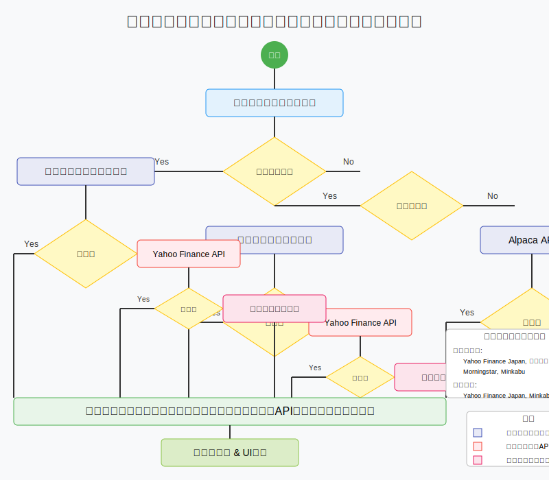

# ポートフォリオ管理アプリケーション

## 概要

このアプリケーションは投資ポートフォリオを管理するためのツールです。複数のデータソースから株価情報を取得し、資産配分の視覚化、リバランス計算、手数料・配当の分析などの機能を提供します。

## 株価データ取得システム

### 概要

このシステムは複数のデータソースを組み合わせて株価情報を効率的かつ信頼性高く取得します。銘柄タイプに応じて最適なAPIを選択し、主要APIが失敗した場合は代替APIを試行する堅牢な仕組みを採用しています。

### 処理フロー図



### 主な機能

1. **銘柄タイプの自動判定**
   - 日本株/投資信託: Yahoo Finance APIを優先使用
   - 米国株: Alpaca APIを優先使用

2. **複数データソースの活用**
   - Yahoo Finance API: 日本株と投資信託のプライマリソース
   - Alpaca API: 米国株のプライマリソース
   - Alpha Vantage API: 代替データソース
   - Python yfinance: プログラムによる代替実装

3. **エラーハンドリングとフォールバックメカニズム**
   - API制限、タイムアウト、ネットワークエラーに対応
   - すべてのAPIが失敗した場合の合理的なデフォルト値生成
   - ユーザーへの明示的な通知

4. **データの拡張**
   - 手数料率の自動推定
   - 配当情報の取得と推定
   - 銘柄タイプと属性の分析

## インストール方法

```bash
# 依存パッケージのインストール
npm install

# 開発サーバーの起動
npm start

# ビルド
npm run build
```

## 環境変数の設定

`.env`ファイルを作成し、以下の環境変数を設定します。

```
REACT_APP_ALPHA_VANTAGE_API_KEY=あなたのAlpha Vantage APIキー
REACT_APP_ALPACA_API_KEY=あなたのAlpaca APIキー
REACT_APP_ALPACA_API_SECRET=あなたのAlpaca APIシークレット
REACT_APP_GOOGLE_CLIENT_ID=あなたのGoogle OAuth ClientID
```

## API関連の設定

API呼び出しはNetlifyの関数を通じて行われます。`netlify.toml`ファイルで以下の設定が定義されています：

```toml
[[redirects]]
  from = "/api/*"
  to = "/.netlify/functions/:splat"
  status = 200
  force = true
```

## 既知のバグと制限事項

1. **日本の投資信託・個別株の取得エラー**
   - yfinanceが動作せず、外部公開可能な無料APIが見つかっていないため実装が困難
   - J-Quants APIが使いたかったが、外部公開するアプリで使うことは規約違反になる
   - 作者がアメリカ在住であるため日本の証券口座開設ができず、証券口座のAPIが利用できない
   - なお、アメリカの証券口座は開設できるため、アメリカの株価は取得できる

2. **API制限による取得エラー**
   - Alpha Vantage APIの無料プランでは1分間に5リクエスト、1日に500リクエストという制限あり
   - 多数の銘柄を一度に更新する際にエラーが発生する可能性あり

3. **データソースの鮮度と精度**
   - 無料APIのため、データの更新頻度に制限あり
   - 特に日本株・投資信託のデータはリアルタイム性が低い場合あり

## 今後の開発予定

1. 保有資産の時系列データ保存と可視化
2. パフォーマンス分析機能の強化
3. より多くのデータソースのサポート
4. UI/UXの改善

## 貢献方法

1. このリポジトリをフォーク
2. 新しいブランチを作成 (`git checkout -b feature/amazing-feature`)
3. 変更をコミット (`git commit -m 'Add some amazing feature'`)
4. ブランチにプッシュ (`git push origin feature/amazing-feature`)
5. プルリクエストを作成

## ライセンス

このプロジェクトは MIT ライセンスの下で公開されています。詳細は `LICENSE` ファイルを参照してください。
