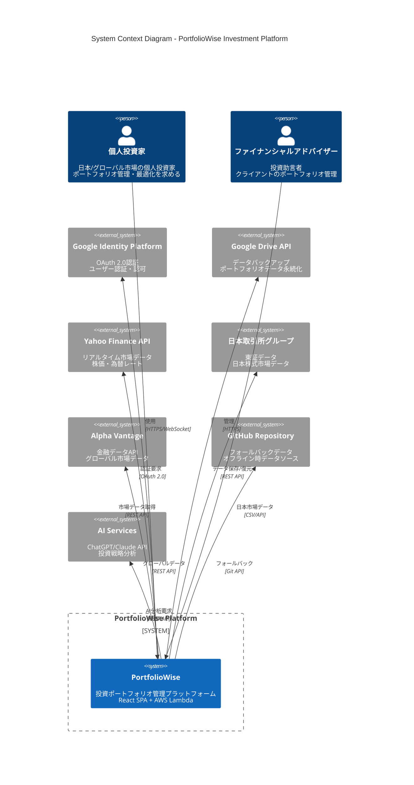
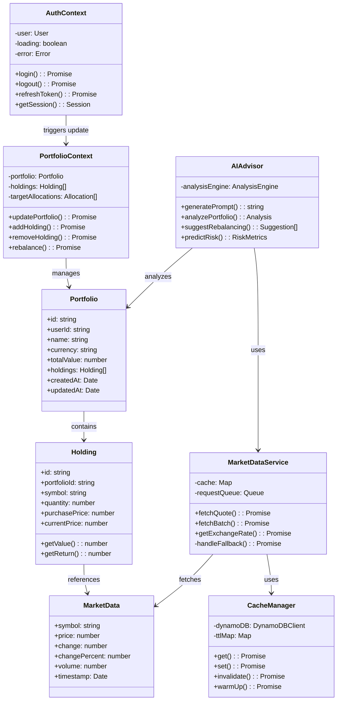

# PortfolioWise C4モデル詳細図表

## 1. Level 1: システムコンテキスト図（詳細版）



## 2. Level 2: コンテナ図（詳細版）

```mermaid
C4Container
    title Container Diagram - PortfolioWise Architecture Details

    Person(user, "投資家", "Web/Mobile")
    
    Container_Boundary(frontend_layer, "Frontend Layer") {
        Container(react_spa, "React SPA", "React 18, TypeScript", "シングルページアプリケーション<br/>ポートフォリオ管理UI")
        Container(service_worker, "Service Worker", "JavaScript", "オフライン対応<br/>キャッシング")
        Container(cdn, "Cloudflare CDN", "Edge Network", "静的資産配信<br/>グローバル配信")
        ContainerDb(local_storage, "Local Storage", "Browser API", "ユーザー設定<br/>一時データ")
    }
    
    Container_Boundary(api_layer, "API Gateway Layer") {
        Container(api_gateway, "API Gateway", "AWS", "REST API<br/>Rate Limiting")
        Container(authorizer, "Lambda Authorizer", "Node.js", "JWT検証<br/>認可処理")
        Container(waf, "AWS WAF", "Security", "DDoS防御<br/>SQLi/XSS対策")
    }
    
    Container_Boundary(compute_layer, "Compute Layer") {
        Container(market_data_fn, "Market Data Lambda", "Node.js 18", "市場データ処理<br/>キャッシュ管理")
        Container(portfolio_fn, "Portfolio Lambda", "Node.js 18", "ポートフォリオ演算<br/>最適化アルゴリズム")
        Container(auth_fn, "Auth Lambda", "Node.js 18", "認証処理<br/>セッション管理")
        Container(ai_analysis_fn, "AI Analysis Lambda", "Node.js 18", "AI統合<br/>プロンプト生成")
        Container(scheduled_fn, "Scheduled Lambda", "Node.js 18", "定期処理<br/>キャッシュウォーミング")
    }
    
    Container_Boundary(data_layer, "Data Layer") {
        ContainerDb(dynamodb_cache, "Cache Table", "DynamoDB", "市場データキャッシュ<br/>TTL: 1時間")
        ContainerDb(dynamodb_session, "Session Table", "DynamoDB", "ユーザーセッション<br/>TTL: 24時間")
        ContainerDb(dynamodb_portfolio, "Portfolio Table", "DynamoDB", "ポートフォリオデータ<br/>永続保存")
        ContainerDb(s3_backup, "S3 Bucket", "AWS S3", "バックアップ<br/>ログアーカイブ")
        Container(secrets_manager, "Secrets Manager", "AWS", "APIキー管理<br/>自動ローテーション")
    }
    
    Container_Boundary(monitoring, "Monitoring & Observability") {
        Container(cloudwatch, "CloudWatch", "AWS", "ログ収集<br/>メトリクス")
        Container(xray, "AWS X-Ray", "AWS", "分散トレーシング<br/>パフォーマンス分析")
        Container(sns, "SNS", "AWS", "アラート通知<br/>エラー通知")
    }
    
    System_Ext(external_apis, "External APIs", "Market Data & AI")
    
    Rel(user, cdn, "アクセス", "HTTPS")
    Rel(cdn, react_spa, "配信")
    Rel(react_spa, service_worker, "登録")
    Rel(react_spa, local_storage, "保存")
    Rel(react_spa, api_gateway, "API呼び出し", "REST/WebSocket")
    
    Rel(api_gateway, waf, "保護")
    Rel(api_gateway, authorizer, "認証")
    Rel(api_gateway, market_data_fn, "ルーティング")
    Rel(api_gateway, portfolio_fn, "ルーティング")
    Rel(api_gateway, auth_fn, "ルーティング")
    Rel(api_gateway, ai_analysis_fn, "ルーティング")
    
    Rel(market_data_fn, dynamodb_cache, "R/W")
    Rel(portfolio_fn, dynamodb_portfolio, "R/W")
    Rel(auth_fn, dynamodb_session, "R/W")
    Rel(scheduled_fn, dynamodb_cache, "更新")
    
    Rel(market_data_fn, secrets_manager, "取得")
    Rel(market_data_fn, external_apis, "データ取得")
    
    Rel(market_data_fn, cloudwatch, "ログ")
    Rel(portfolio_fn, cloudwatch, "ログ")
    Rel(cloudwatch, sns, "アラート")
```



## 3. Level 3: コンポーネント図 - React SPA詳細

```mermaid
C4Component
    title Component Diagram - React SPA Architecture

    Container_Boundary(react_app, "React Application") {
        Component(app_root, "App.jsx", "React Component", "アプリケーションルート<br/>ルーティング設定")
        
        Component_Boundary(context_layer, "Context Providers") {
            Component(auth_context, "AuthContext", "React Context", "認証状態管理<br/>Google OAuth統合")
            Component(portfolio_context, "PortfolioContext", "React Context", "ポートフォリオデータ<br/>リアルタイム更新")
            Component(theme_context, "ThemeContext", "React Context", "テーマ管理<br/>ダーク/ライトモード")
        }
        
        Component_Boundary(pages, "Page Components") {
            Component(dashboard_page, "Dashboard", "React Page", "ダッシュボード<br/>ポートフォリオ概要")
            Component(ai_advisor_page, "AIAdvisor", "React Page", "AI投資アドバイス<br/>40+分析関数")
            Component(settings_page, "Settings", "React Page", "設定管理<br/>ユーザー設定")
            Component(simulation_page, "Simulation", "React Page", "投資シミュレーション<br/>What-If分析")
        }
        
        Component_Boundary(services, "Service Layer") {
            Component(api_client, "api.js", "HTTP Client", "Axios wrapper<br/>認証ヘッダー管理")
            Component(market_service, "marketDataService", "Service", "市場データ取得<br/>キャッシング戦略")
            Component(portfolio_service, "portfolioService", "Service", "ポートフォリオ操作<br/>計算ロジック")
            Component(ai_service, "aiService", "Service", "AI統合<br/>プロンプト生成")
        }
        
        Component_Boundary(ui_components, "UI Components") {
            Component(atlassian_ui, "Atlassian Components", "UI Library", "デザインシステム<br/>エンタープライズUI")
            Component(charts, "Recharts", "Chart Library", "データ可視化<br/>インタラクティブチャート")
            Component(forms, "Form Components", "React Components", "フォーム管理<br/>バリデーション")
            Component(tables, "Data Tables", "React Components", "データ表示<br/>ソート・フィルター")
        }
        
        Component_Boundary(utils, "Utilities") {
            Component(i18n, "i18n", "Localization", "多言語対応<br/>日本語/英語")
            Component(validators, "Validators", "Validation", "入力検証<br/>ビジネスルール")
            Component(formatters, "Formatters", "Formatting", "データフォーマット<br/>通貨・日付")
            Component(error_handler, "ErrorBoundary", "Error Handling", "エラー処理<br/>フォールバック")
        }
    }
    
    Rel(app_root, auth_context, "初期化")
    Rel(app_root, portfolio_context, "初期化")
    Rel(auth_context, portfolio_context, "連携")
    
    Rel(dashboard_page, portfolio_context, "購読")
    Rel(dashboard_page, market_service, "使用")
    Rel(dashboard_page, charts, "レンダリング")
    
    Rel(ai_advisor_page, ai_service, "AI分析")
    Rel(ai_advisor_page, atlassian_ui, "UI構築")
    
    Rel(market_service, api_client, "API呼び出し")
    Rel(portfolio_service, api_client, "API呼び出し")
    Rel(ai_service, api_client, "API呼び出し")
    
    Rel(api_client, error_handler, "エラー処理")
    Rel(forms, validators, "検証")
    Rel(tables, formatters, "フォーマット")
```

## 4. Level 3: コンポーネント図 - Lambda Functions詳細

```mermaid
C4Component
    title Component Diagram - Lambda Functions Architecture

    Container_Boundary(lambda_functions, "AWS Lambda Functions") {
        
        Component_Boundary(market_data_lambda, "Market Data Lambda") {
            Component(request_handler, "handler.js", "Entry Point", "リクエスト処理<br/>レスポンス生成")
            Component(cache_manager, "cacheManager", "Cache Logic", "キャッシュ戦略<br/>TTL管理")
            Component(data_aggregator, "dataAggregator", "Aggregation", "データ統合<br/>正規化")
            
            Component_Boundary(data_sources, "Data Source Adapters") {
                Component(yahoo_adapter, "yahooAdapter", "API Adapter", "Yahoo Finance<br/>無料API")
                Component(jpx_adapter, "jpxAdapter", "CSV Parser", "JPX データ<br/>20分遅延")
                Component(alpha_adapter, "alphaAdapter", "API Adapter", "Alpha Vantage<br/>有料API")
                Component(scraper_adapter, "scraperAdapter", "Web Scraper", "Cheerio<br/>最終手段")
            }
            
            Component(fallback_manager, "fallbackManager", "Fallback Logic", "フォールバック戦略<br/>エラーハンドリング")
            Component(rate_limiter, "rateLimiter", "Rate Limiting", "レート制限<br/>Bottleneck")
        }
        
        Component_Boundary(portfolio_lambda, "Portfolio Lambda") {
            Component(portfolio_handler, "handler.js", "Entry Point", "CRUD操作<br/>ビジネスロジック")
            Component(calculator, "calculator", "Calculations", "ポートフォリオ計算<br/>リバランス算出")
            Component(optimizer, "optimizer", "Optimization", "最適化アルゴリズム<br/>効率的フロンティア")
            Component(risk_analyzer, "riskAnalyzer", "Risk Analysis", "リスク分析<br/>VaR計算")
        }
        
        Component_Boundary(auth_lambda, "Auth Lambda") {
            Component(auth_handler, "handler.js", "Entry Point", "認証フロー<br/>トークン管理")
            Component(google_oauth, "googleOAuth", "OAuth Client", "Google認証<br/>トークン交換")
            Component(session_manager, "sessionManager", "Session", "セッション作成<br/>検証")
            Component(jwt_manager, "jwtManager", "JWT", "JWT生成<br/>検証")
        }
    }
    
    ContainerDb_Ext(dynamodb, "DynamoDB", "NoSQL")
    Container_Ext(secrets, "Secrets Manager", "AWS")
    System_Ext(external_apis, "External APIs")
    
    Rel(request_handler, cache_manager, "キャッシュ確認")
    Rel(cache_manager, dynamodb, "読み書き")
    
    Rel(request_handler, data_aggregator, "データ要求")
    Rel(data_aggregator, yahoo_adapter, "取得試行")
    Rel(data_aggregator, jpx_adapter, "フォールバック")
    Rel(data_aggregator, alpha_adapter, "フォールバック")
    Rel(data_aggregator, scraper_adapter, "最終手段")
    
    Rel(yahoo_adapter, rate_limiter, "レート制御")
    Rel(rate_limiter, external_apis, "API呼び出し")
    
    Rel(data_aggregator, fallback_manager, "エラー時")
    Rel(fallback_manager, dynamodb, "フォールバックデータ")
    
    Rel(portfolio_handler, calculator, "計算実行")
    Rel(calculator, optimizer, "最適化")
    Rel(optimizer, risk_analyzer, "リスク評価")
    
    Rel(auth_handler, google_oauth, "OAuth実行")
    Rel(google_oauth, session_manager, "セッション作成")
    Rel(session_manager, jwt_manager, "トークン生成")
    Rel(jwt_manager, dynamodb, "保存")
```

## 5. Level 4: コード図（主要クラス関係）



---

*作成日: 2025-09-05*  
*バージョン: 2.0.0*  
*次回更新: TypeScript移行完了時*