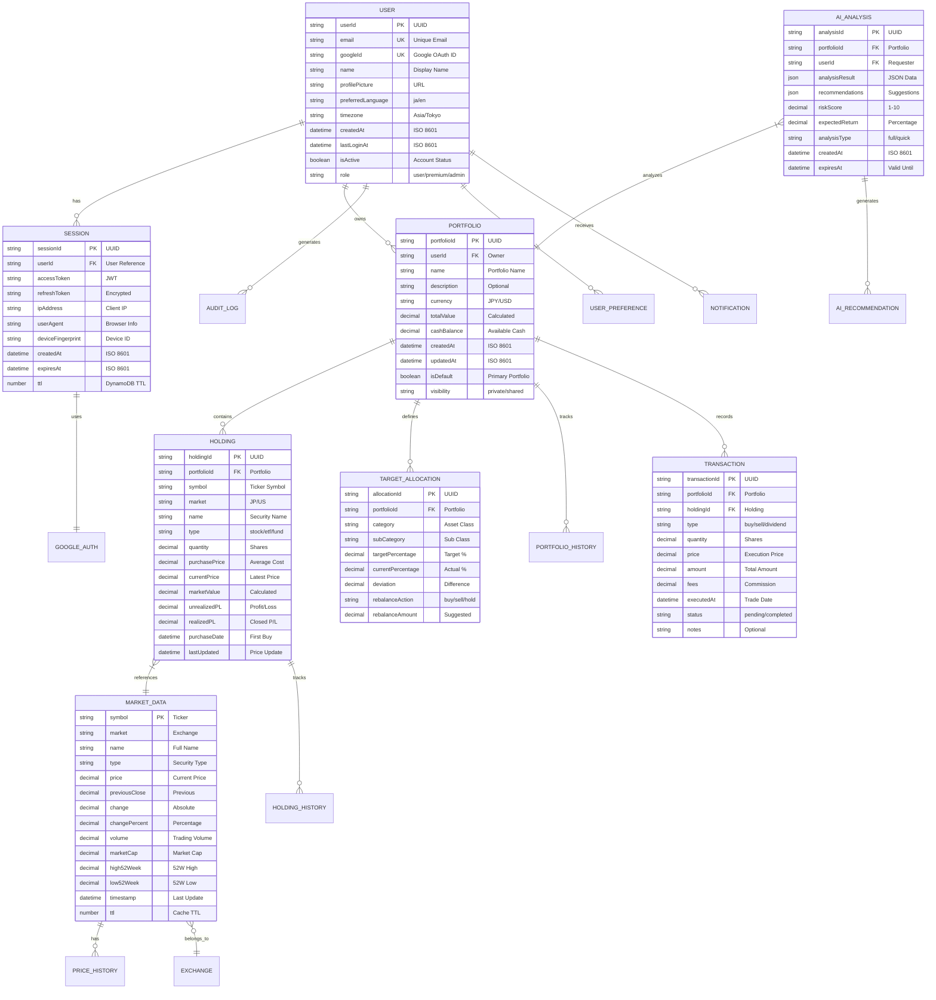
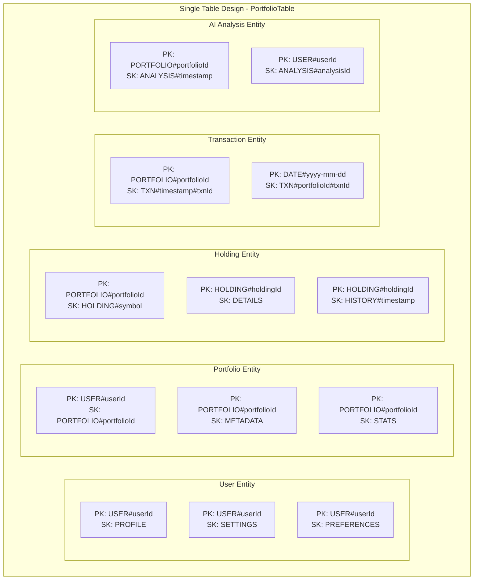
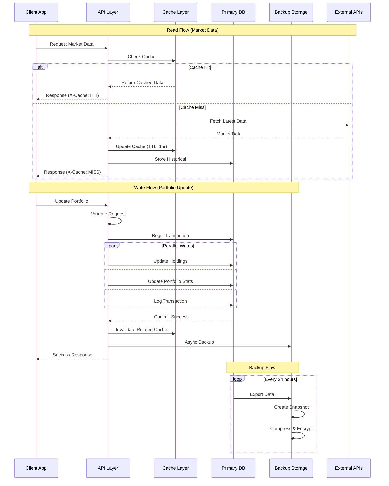
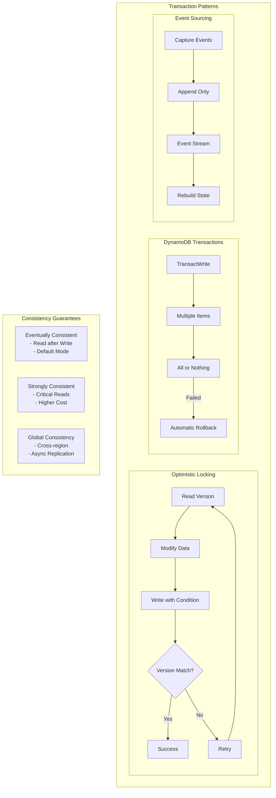
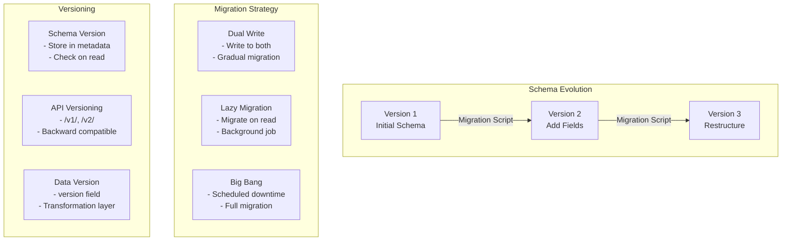

# PortfolioWise データモデル詳細設計

## 1. 論理データモデル（ER図）



## 2. DynamoDB物理データモデル

### 2.1 テーブル設計

```yaml
Tables:
  # 1. Cache Table (高頻度アクセス、TTL付き)
  MarketDataCache:
    PartitionKey: pk (String) # "MARKET#symbol"
    SortKey: sk (String) # "DATA#timestamp"
    Attributes:
      - price: Number
      - change: Number
      - changePercent: Number
      - volume: Number
      - timestamp: String
      - ttl: Number # Unix timestamp for auto-deletion
    GlobalSecondaryIndexes:
      - GSI1:
          PartitionKey: gsi1pk # "MARKET#market"
          SortKey: gsi1sk # "PRICE#symbol"
      - GSI2:
          PartitionKey: gsi2pk # "UPDATE#date"
          SortKey: gsi2sk # "TIME#timestamp"
    
  # 2. Session Table (認証管理)
  SessionTable:
    PartitionKey: pk (String) # "SESSION#sessionId"
    SortKey: sk (String) # "USER#userId"
    Attributes:
      - accessToken: String (encrypted)
      - refreshToken: String (encrypted)
      - ipAddress: String
      - userAgent: String
      - deviceFingerprint: String
      - createdAt: String
      - expiresAt: String
      - ttl: Number
    GlobalSecondaryIndexes:
      - UserIndex:
          PartitionKey: userId
          SortKey: createdAt
    
  # 3. Main Application Table (Single Table Design)
  PortfolioTable:
    PartitionKey: pk (String)
    SortKey: sk (String)
    Attributes: (varies by entity type)
    GlobalSecondaryIndexes:
      - GSI1:
          PartitionKey: gsi1pk
          SortKey: gsi1sk
      - GSI2:
          PartitionKey: gsi2pk
          SortKey: gsi2sk
      - GSI3:
          PartitionKey: gsi3pk
          SortKey: gsi3sk
```

### 2.2 Single Table Design パターン



### 2.3 アクセスパターン

```yaml
Access Patterns:
  # ユーザー関連
  1. Get User by ID:
     Query: pk = "USER#userId" AND sk = "PROFILE"
  
  2. Get User's Portfolios:
     Query: pk = "USER#userId" AND sk begins_with "PORTFOLIO#"
  
  3. Get User's Settings:
     Query: pk = "USER#userId" AND sk = "SETTINGS"
  
  # ポートフォリオ関連
  4. Get Portfolio Details:
     Query: pk = "PORTFOLIO#portfolioId" AND sk = "METADATA"
  
  5. Get Portfolio Holdings:
     Query: pk = "PORTFOLIO#portfolioId" AND sk begins_with "HOLDING#"
  
  6. Get Portfolio Transactions:
     Query: pk = "PORTFOLIO#portfolioId" AND sk begins_with "TXN#"
  
  # ホールディング関連
  7. Get Holding Details:
     Query: pk = "HOLDING#holdingId" AND sk = "DETAILS"
  
  8. Get Holding History:
     Query: pk = "HOLDING#holdingId" AND sk begins_with "HISTORY#"
  
  # トランザクション関連
  9. Get Transactions by Date:
     Query: GSI1: gsi1pk = "DATE#yyyy-mm-dd"
  
  10. Get User's All Transactions:
      Query: GSI2: gsi2pk = "USER#userId" AND gsi2sk begins_with "TXN#"
  
  # AI分析関連
  11. Get Latest Analysis:
      Query: pk = "PORTFOLIO#portfolioId" AND sk begins_with "ANALYSIS#" LIMIT 1 DESC
  
  12. Get User's Analysis History:
      Query: GSI3: gsi3pk = "USER#userId" AND gsi3sk begins_with "ANALYSIS#"
```

## 3. データフロー設計



## 4. データ整合性とトランザクション



## 5. データライフサイクル管理

```mermaid
graph LR
    subgraph "Data Lifecycle"
        subgraph "Creation"
            Create[Data Created]
            Validate[Validation]
            Encrypt[Encryption]
            Store[Storage]
        end
        
        subgraph "Active Use"
            Read[Read Access]
            Update[Updates]
            Cache[Caching]
            Replicate[Replication]
        end
        
        subgraph "Archive"
            Archive[Move to Archive]
            Compress[Compression]
            ColdStorage[S3 Glacier]
        end
        
        subgraph "Retention & Deletion"
            Retention[Retention Policy<br/>- User Data: 7 years<br/>- Logs: 90 days<br/>- Cache: 1 hour]
            Deletion[Secure Deletion<br/>- Overwrite<br/>- Audit Log<br/>- Confirmation]
        end
    end
    
    Create --> Validate
    Validate --> Encrypt
    Encrypt --> Store
    
    Store --> Read
    Read --> Update
    Update --> Cache
    Cache --> Replicate
    
    Replicate --> Archive
    Archive --> Compress
    Compress --> ColdStorage
    
    ColdStorage --> Retention
    Retention --> Deletion
```

## 6. パフォーマンス最適化戦略

```yaml
Optimization Strategies:
  1. Caching Strategy:
     - L1 Cache: Browser LocalStorage (5 min)
     - L2 Cache: CloudFront (15 min)
     - L3 Cache: DynamoDB Cache Table (1 hour)
     - L4 Cache: Lambda Memory (5 min)
  
  2. Query Optimization:
     - Use GSI for alternate access patterns
     - Batch operations for multiple items
     - Projection to reduce data transfer
     - Parallel queries when possible
  
  3. Write Optimization:
     - Batch writes (up to 25 items)
     - Async processing for non-critical
     - Write sharding for hot partitions
     - Conditional writes to prevent overwrites
  
  4. Data Compression:
     - GZIP for API responses
     - Binary format for large datasets
     - Image optimization (WebP)
     - Log compression before storage
  
  5. Partition Key Design:
     - Avoid hot partitions
     - Use composite keys
     - Time-based sharding
     - Random suffix for high-cardinality
```

## 7. データ移行とバージョニング



## 8. データ品質管理

```yaml
Data Quality Metrics:
  Accuracy:
    - Validation rules at input
    - Cross-reference checks
    - External data verification
  
  Completeness:
    - Required field enforcement
    - Default value policies
    - Missing data reports
  
  Consistency:
    - Foreign key constraints (logical)
    - Business rule validation
    - Cross-table consistency checks
  
  Timeliness:
    - Data freshness monitoring
    - Update frequency tracking
    - Stale data detection
  
  Uniqueness:
    - Duplicate detection
    - Merge strategies
    - De-duplication jobs
  
  Validity:
    - Format validation
    - Range checks
    - Business logic validation
```

---

*作成日: 2025-09-05*  
*バージョン: 2.0.0*  
*データアーキテクチャチーム*  
*次回レビュー: 2025-10-01*