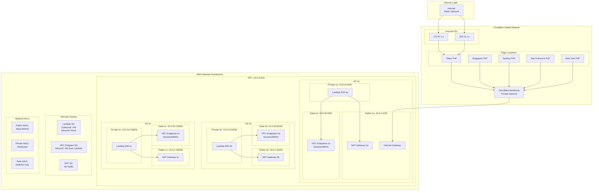
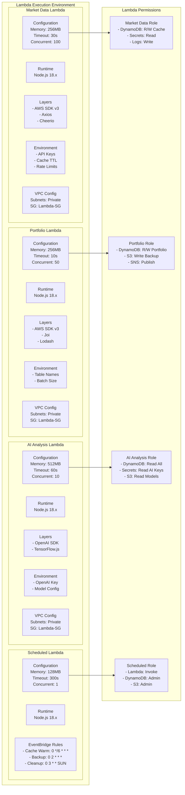
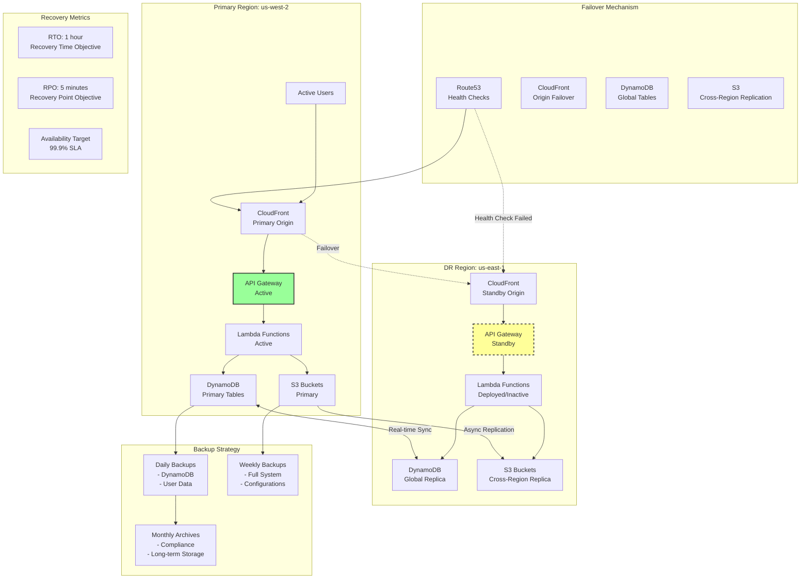

# PortfolioWise インフラストラクチャ詳細設計

## 1. AWS インフラストラクチャ全体図

```mermaid
graph TB
    subgraph "Internet"
        Users[fa:fa-users Users<br/>Global Access]
        GoogleAuth[fa:fa-google Google OAuth]
        MarketAPIs[fa:fa-chart-line Market APIs]
    end
    
    subgraph "Cloudflare Edge Network"
        CF_DNS[fa:fa-globe DNS<br/>portfolio-wise.com]
        CF_CDN[fa:fa-server CDN<br/>150+ PoPs]
        CF_WAF[fa:fa-shield-alt WAF<br/>DDoS Protection]
        CF_Pages[fa:fa-file Pages<br/>Static Hosting]
        CF_Analytics[fa:fa-chart-bar Analytics]
    end
    
    subgraph "AWS Region: us-west-2"
        subgraph "Edge Services"
            CloudFront[fa:fa-cloud CloudFront<br/>API Cache]
            R53[fa:fa-map Route53<br/>DNS Failover]
        end
        
        subgraph "API Layer - VPC: 10.0.0.0/16"
            subgraph "Public Subnet: 10.0.1.0/24"
                APIGW[fa:fa-gateway API Gateway<br/>REST/WebSocket]
                ALB[fa:fa-balance-scale ALB<br/>Load Balancer]
            end
            
            subgraph "Private Subnet: 10.0.10.0/24"
                subgraph "Lambda Functions"
                    MarketLambda[fa:fa-function Market Data<br/>256MB]
                    AuthLambda[fa:fa-function Auth<br/>128MB]
                    PortfolioLambda[fa:fa-function Portfolio<br/>256MB]
                    AILambda[fa:fa-function AI Analysis<br/>512MB]
                    ScheduledLambda[fa:fa-function Scheduled<br/>128MB]
                end
            end
            
            NATGateway[fa:fa-exchange NAT Gateway<br/>Outbound Internet]
        end
        
        subgraph "Data Layer"
            subgraph "DynamoDB Global Tables"
                DDB_Cache[fa:fa-database Cache Table<br/>On-Demand<br/>TTL: 1hr]
                DDB_Session[fa:fa-database Session Table<br/>On-Demand<br/>TTL: 24hr]
                DDB_Portfolio[fa:fa-database Portfolio Table<br/>On-Demand<br/>Backup: Daily]
                DDB_Audit[fa:fa-database Audit Table<br/>On-Demand<br/>Retention: 90d]
            end
            
            subgraph "S3 Buckets"
                S3_Static[fa:fa-archive Static Assets<br/>CloudFront Origin]
                S3_Backup[fa:fa-archive Backups<br/>Lifecycle: 30d]
                S3_Logs[fa:fa-archive Logs<br/>Lifecycle: 7d]
            end
        end
        
        subgraph "Security & Management"
            SecretsMgr[fa:fa-key Secrets Manager<br/>Auto-rotation]
            KMS[fa:fa-lock KMS<br/>Encryption Keys]
            IAM[fa:fa-users IAM Roles<br/>Least Privilege]
            SSM[fa:fa-cog Parameter Store<br/>Config]
        end
        
        subgraph "Monitoring & Logging"
            CloudWatch[fa:fa-chart-line CloudWatch<br/>Metrics/Logs]
            XRay[fa:fa-search X-Ray<br/>Tracing]
            EventBridge[fa:fa-calendar EventBridge<br/>Schedulers]
            SNS[fa:fa-bell SNS<br/>Alerts]
        end
    end
    
    subgraph "Disaster Recovery"
        subgraph "AWS Region: us-east-1 (Standby)"
            DDB_Replica[fa:fa-database DynamoDB<br/>Global Replica]
            S3_Replica[fa:fa-archive S3 Cross-Region<br/>Replication]
        end
    end
    
    Users -->|HTTPS| CF_DNS
    CF_DNS --> CF_CDN
    CF_CDN --> CF_WAF
    CF_WAF --> CF_Pages
    
    Users -->|API| CloudFront
    CloudFront --> APIGW
    
    APIGW --> AuthLambda
    APIGW --> MarketLambda
    APIGW --> PortfolioLambda
    APIGW --> AILambda
    
    MarketLambda --> NATGateway
    NATGateway --> MarketAPIs
    
    AuthLambda --> GoogleAuth
    
    MarketLambda --> DDB_Cache
    AuthLambda --> DDB_Session
    PortfolioLambda --> DDB_Portfolio
    
    ScheduledLambda --> EventBridge
    
    All Lambda Functions --> CloudWatch
    All Lambda Functions --> XRay
    CloudWatch --> SNS
    
    DDB_Portfolio -.->|Replication| DDB_Replica
    S3_Backup -.->|Replication| S3_Replica
    
    style Users fill:#f9f,stroke:#333,stroke-width:2px
    style APIGW fill:#ff9,stroke:#333,stroke-width:4px
    style DDB_Cache fill:#9f9,stroke:#333,stroke-width:2px
    style SecretsMgr fill:#9ff,stroke:#333,stroke-width:2px
```

## 2. ネットワークアーキテクチャ詳細



## 3. Lambda関数詳細設計



## 4. データストレージ設計

```mermaid
graph TB
    subgraph "DynamoDB Tables Structure"
        subgraph "Cache Table"
            Cache_PK[Partition Key: symbol#market]
            Cache_SK[Sort Key: timestamp]
            Cache_Attr[Attributes:<br/>- price: Number<br/>- change: Number<br/>- volume: Number<br/>- ttl: Number]
            Cache_GSI[GSI:<br/>- market-timestamp-index<br/>- ttl-index]
        end
        
        subgraph "Session Table"
            Session_PK[Partition Key: sessionId]
            Session_Attr[Attributes:<br/>- userId: String<br/>- accessToken: String<br/>- refreshToken: String<br/>- expiresAt: Number<br/>- ttl: Number]
            Session_GSI[GSI:<br/>- userId-index<br/>- expiresAt-index]
        end
        
        subgraph "Portfolio Table"
            Portfolio_PK[Partition Key: userId]
            Portfolio_SK[Sort Key: portfolioId]
            Portfolio_Attr[Attributes:<br/>- name: String<br/>- holdings: List<br/>- allocations: Map<br/>- totalValue: Number<br/>- currency: String<br/>- updatedAt: String]
            Portfolio_GSI[GSI:<br/>- portfolioId-index<br/>- updatedAt-index]
        end
        
        subgraph "Audit Table"
            Audit_PK[Partition Key: date]
            Audit_SK[Sort Key: timestamp#userId]
            Audit_Attr[Attributes:<br/>- action: String<br/>- resource: String<br/>- changes: Map<br/>- ip: String<br/>- userAgent: String]
            Audit_GSI[GSI:<br/>- userId-date-index<br/>- action-date-index]
        end
    end
    
    subgraph "S3 Bucket Structure"
        subgraph "portfolio-wise-static"
            Static_Structure[/assets<br/>/images<br/>/fonts<br/>/data]
            Static_Policy[Bucket Policy:<br/>CloudFront OAI Only]
            Static_Lifecycle[No Lifecycle]
        end
        
        subgraph "portfolio-wise-backups"
            Backup_Structure[/daily/<br/>  /{date}/<br/>    /{userId}/<br/>/weekly/<br/>/monthly/]
            Backup_Policy[Bucket Policy:<br/>Lambda Write Only]
            Backup_Lifecycle[Lifecycle:<br/>- Daily: 7 days<br/>- Weekly: 30 days<br/>- Monthly: 365 days]
        end
        
        subgraph "portfolio-wise-logs"
            Logs_Structure[/cloudfront/<br/>/api-gateway/<br/>/lambda/<br/>/waf/]
            Logs_Policy[Bucket Policy:<br/>AWS Services Only]
            Logs_Lifecycle[Lifecycle:<br/>- Standard: 7 days<br/>- IA: 30 days<br/>- Glacier: 90 days<br/>- Delete: 365 days]
        end
    end
    
    Cache_PK --> Cache_SK
    Cache_SK --> Cache_Attr
    Cache_Attr --> Cache_GSI
    
    Session_PK --> Session_Attr
    Session_Attr --> Session_GSI
    
    Portfolio_PK --> Portfolio_SK
    Portfolio_SK --> Portfolio_Attr
    Portfolio_Attr --> Portfolio_GSI
    
    Audit_PK --> Audit_SK
    Audit_SK --> Audit_Attr
    Audit_Attr --> Audit_GSI
```

## 5. 監視・ロギングアーキテクチャ

```mermaid
graph TB
    subgraph "Application Layer"
        React[React SPA<br/>console.log]
        Lambda[Lambda Functions<br/>winston logger]
        APIGW[API Gateway<br/>Access Logs]
    end
    
    subgraph "CloudWatch"
        subgraph "Log Groups"
            LG_Lambda[/aws/lambda/*<br/>Retention: 30d]
            LG_API[/aws/apigateway/*<br/>Retention: 7d]
            LG_Custom[/custom/application<br/>Retention: 14d]
        end
        
        subgraph "Metrics"
            M_System[System Metrics<br/>- CPU<br/>- Memory<br/>- Network]
            M_Custom[Custom Metrics<br/>- API Latency<br/>- Cache Hit Rate<br/>- Error Rate]
            M_Business[Business Metrics<br/>- Active Users<br/>- Portfolio Value<br/>- API Usage]
        end
        
        subgraph "Alarms"
            A_Critical[Critical<br/>- Error Rate > 1%<br/>- Lambda Timeout > 50%<br/>- API 5xx > 10/min]
            A_Warning[Warning<br/>- Latency > 2s<br/>- Cache Miss > 50%<br/>- Memory > 80%]
            A_Info[Info<br/>- New User Signup<br/>- Large Portfolio Change<br/>- Unusual Activity]
        end
        
        subgraph "Dashboards"
            D_Ops[Operations Dashboard<br/>- System Health<br/>- Performance<br/>- Errors]
            D_Business[Business Dashboard<br/>- User Metrics<br/>- Usage Patterns<br/>- Growth]
            D_Security[Security Dashboard<br/>- Auth Failures<br/>- Suspicious Activity<br/>- WAF Blocks]
        end
    end
    
    subgraph "X-Ray Tracing"
        ServiceMap[Service Map<br/>End-to-End View]
        TraceAnalysis[Trace Analysis<br/>Performance Bottlenecks]
        ErrorAnalysis[Error Analysis<br/>Root Cause]
    end
    
    subgraph "Alerting"
        SNS_Topic[SNS Topics<br/>- critical-alerts<br/>- warning-alerts<br/>- info-notifications]
        Email[Email<br/>admin@portfolio-wise.com]
        Slack[Slack<br/>#alerts]
        PagerDuty[PagerDuty<br/>On-call]
    end
    
    React --> LG_Custom
    Lambda --> LG_Lambda
    APIGW --> LG_API
    
    LG_Lambda --> M_System
    LG_API --> M_Custom
    LG_Custom --> M_Business
    
    M_System --> A_Critical
    M_Custom --> A_Warning
    M_Business --> A_Info
    
    A_Critical --> SNS_Topic
    A_Warning --> SNS_Topic
    
    SNS_Topic --> Email
    SNS_Topic --> Slack
    SNS_Topic --> PagerDuty
    
    Lambda --> ServiceMap
    ServiceMap --> TraceAnalysis
    TraceAnalysis --> ErrorAnalysis
```

## 6. 災害復旧（DR）アーキテクチャ



## 7. コスト最適化アーキテクチャ

```mermaid
graph TB
    subgraph "Cost Optimization Strategies"
        subgraph "Compute Optimization"
            Lambda_Right[Lambda Right-Sizing<br/>- Market: 256MB<br/>- Auth: 128MB<br/>- AI: 512MB]
            Lambda_Reserved[Reserved Concurrency<br/>- Predictable Load<br/>- Cost Savings]
            Spot_Instances[Spot for Batch<br/>- 70% Savings<br/>- Non-critical]
        end
        
        subgraph "Storage Optimization"
            DDB_OnDemand[DynamoDB On-Demand<br/>- No Fixed Cost<br/>- Scale to Zero]
            S3_Lifecycle[S3 Intelligent Tiering<br/>- Automatic Optimization<br/>- 30-60% Savings]
            Cache_TTL[Aggressive Caching<br/>- Reduce API Calls<br/>- Lower Compute]
        end
        
        subgraph "Network Optimization"
            CF_Caching[CloudFront Caching<br/>- Reduce Origin Requests<br/>- Lower Transfer Costs]
            VPC_Endpoints[VPC Endpoints<br/>- No NAT Charges<br/>- Direct Service Access]
            Data_Compression[Response Compression<br/>- Gzip/Brotli<br/>- 70% Size Reduction]
        end
        
        subgraph "API Optimization"
            Free_APIs[Free API Priority<br/>1. Yahoo Finance2<br/>2. JPX CSV<br/>3. Paid APIs (last resort)]
            Batch_Requests[Batch Processing<br/>- Combine Requests<br/>- Reduce Round Trips]
            Rate_Limiting[Smart Rate Limiting<br/>- Prevent Abuse<br/>- Control Costs]
        end
    end
    
    subgraph "Monthly Cost Breakdown"
        Lambda_Cost[$5/month<br/>~1M requests]
        DDB_Cost[$8/month<br/>On-demand pricing]
        S3_Cost[$3/month<br/>100GB storage]
        Network_Cost[$5/month<br/>Data transfer]
        Other_Cost[$4/month<br/>CloudWatch, etc]
        Total[$25/month<br/>Total Cost]
    end
    
    subgraph "Free Tier Usage"
        Lambda_Free[Lambda<br/>1M requests/month<br/>✓ Within limit]
        DDB_Free[DynamoDB<br/>25GB storage<br/>✓ Within limit]
        S3_Free[S3<br/>5GB storage<br/>✓ Within limit]
        CW_Free[CloudWatch<br/>10 custom metrics<br/>✓ Within limit]
    end
    
    Lambda_Right --> Lambda_Cost
    DDB_OnDemand --> DDB_Cost
    S3_Lifecycle --> S3_Cost
    CF_Caching --> Network_Cost
    
    Lambda_Cost --> Total
    DDB_Cost --> Total
    S3_Cost --> Total
    Network_Cost --> Total
    Other_Cost --> Total
```

---

*作成日: 2025-09-05*  
*バージョン: 2.0.0*  
*インフラチーム責任*  
*次回レビュー: 2025-10-01*