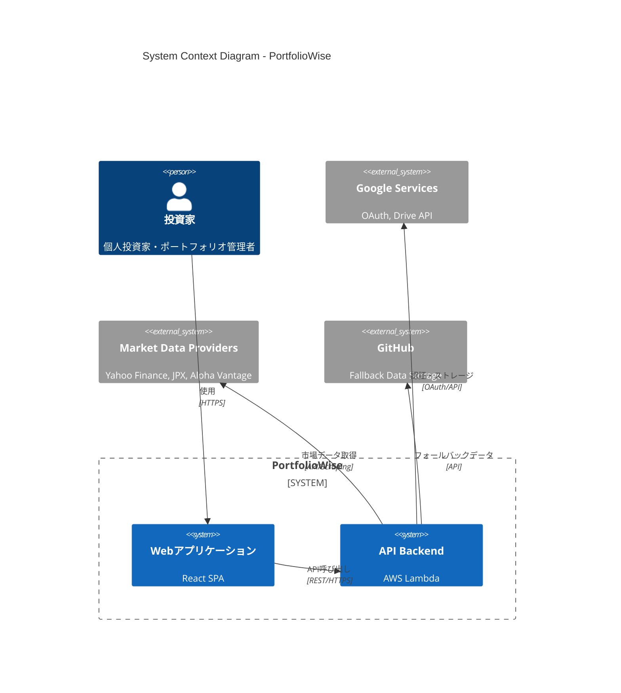
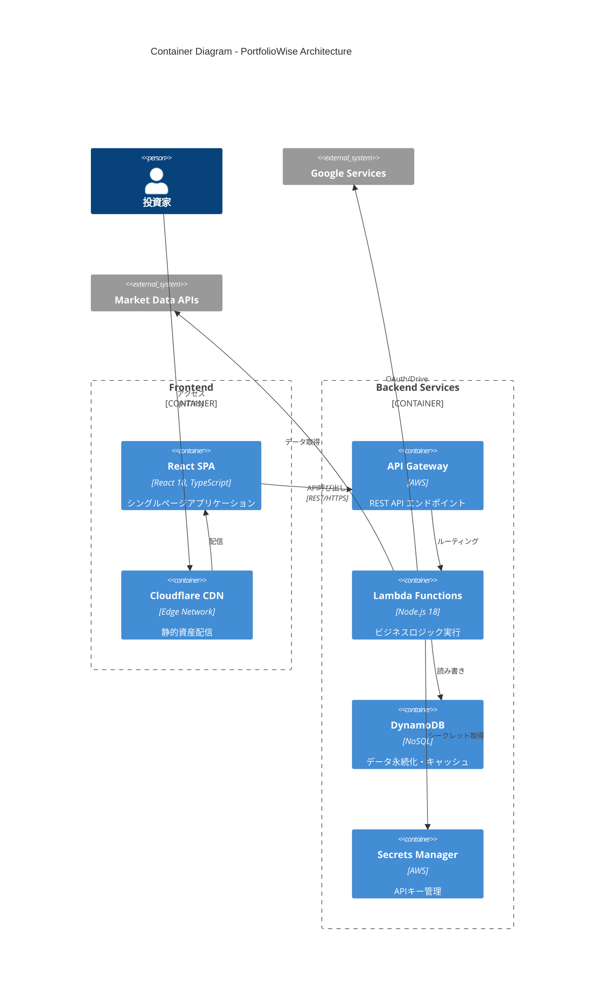
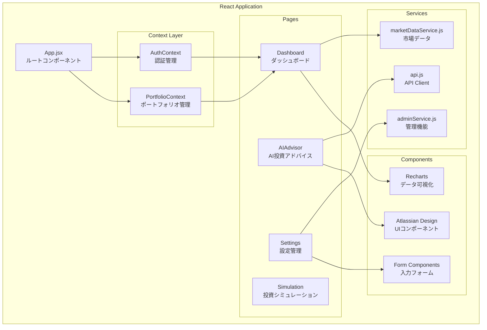
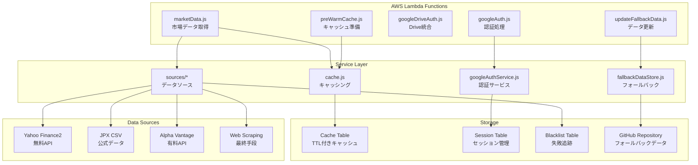
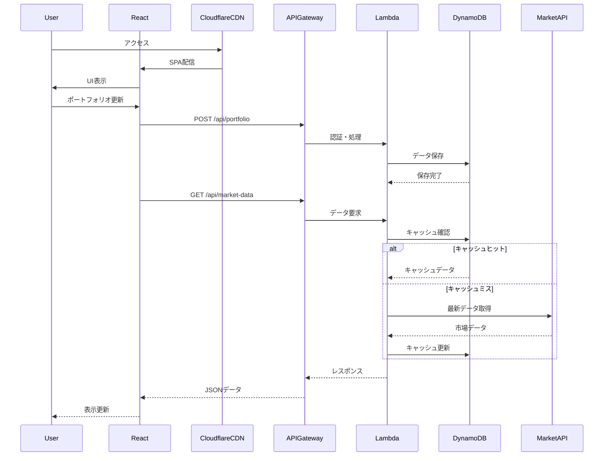
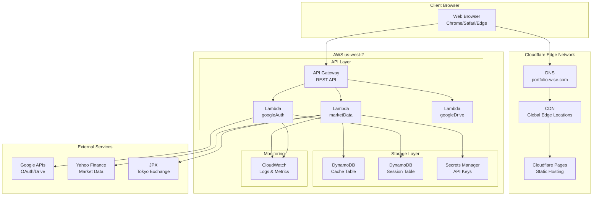
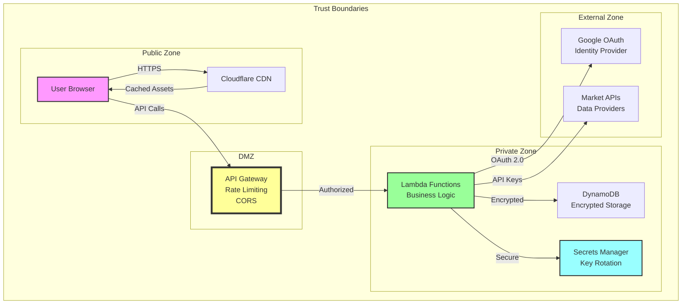
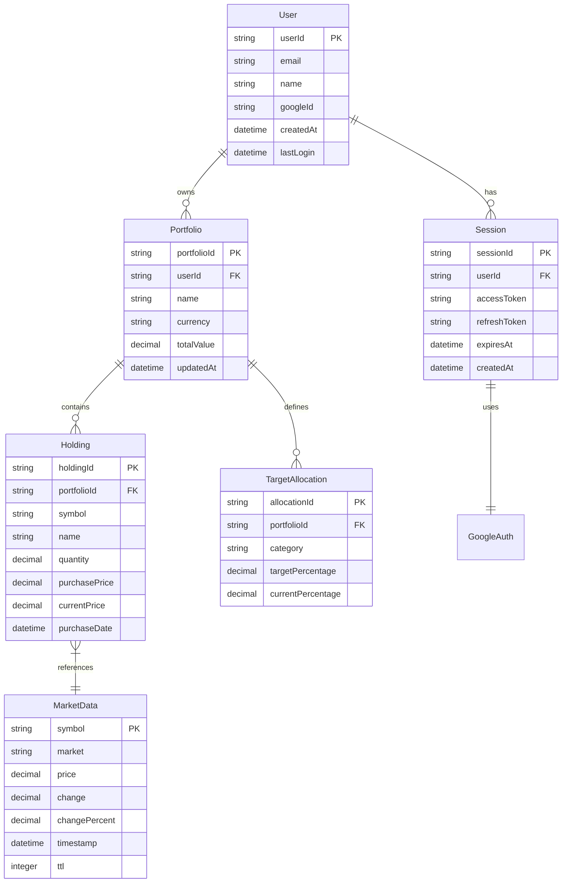
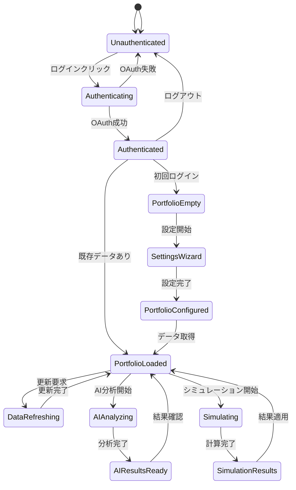

# PortfolioWise アーキテクチャ設計書

## 1. システムコンテキスト図



## 2. コンテナ図



## 3. コンポーネント図（フロントエンド）



## 4. コンポーネント図（バックエンド）



## 5. データフロー図



## 6. デプロイメント図



## 7. セキュリティアーキテクチャ



## 8. データモデル



## 9. 状態遷移図



## 10. API エンドポイント構成

```yaml
API Endpoints:
  Authentication:
    - POST /api/auth/google/login
    - POST /api/auth/google/callback
    - POST /api/auth/logout
    - GET  /api/auth/session
    
  Portfolio Management:
    - GET  /api/portfolio
    - POST /api/portfolio
    - PUT  /api/portfolio/{id}
    - DELETE /api/portfolio/{id}
    
  Market Data:
    - GET  /api/market-data?symbols={symbols}&type={type}
    - POST /api/market-data/batch
    - GET  /api/exchange-rate/{from}/{to}
    
  Google Drive:
    - POST /api/drive/save
    - GET  /api/drive/load
    - GET  /api/drive/list
    
  Admin:
    - GET  /api/admin/metrics
    - POST /api/admin/cache/clear
    - GET  /api/admin/health
```

## 更新履歴

| 日付 | バージョン | 更新内容 |
|------|------------|----------|
| 2025-09-04 | 1.0.0 | 初版作成・全体アーキテクチャ図作成 |

---
*本ドキュメントは自動生成されました。最新情報はソースコードを参照してください。*