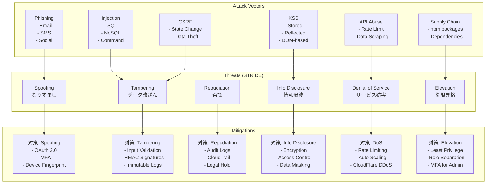
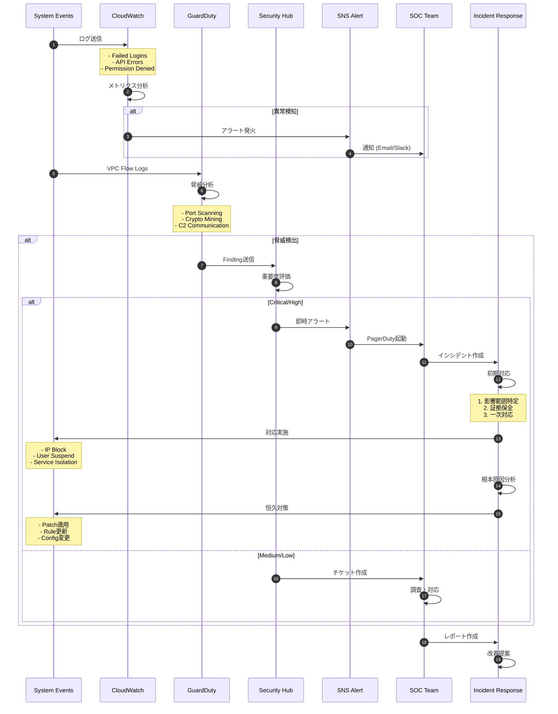
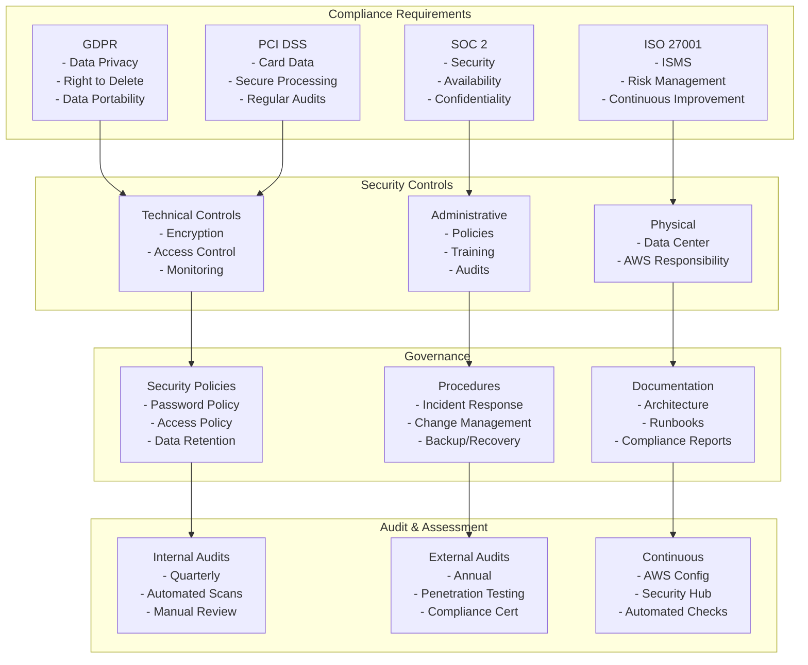
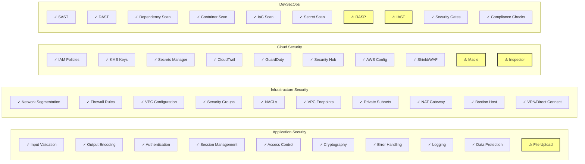
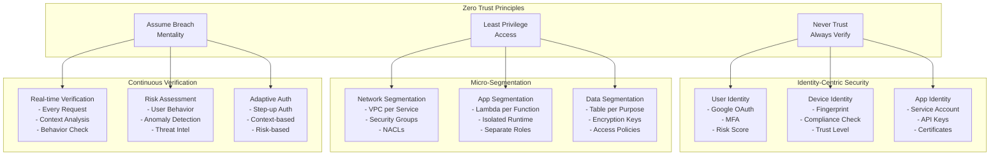

# PortfolioWise セキュリティアーキテクチャ

## 1. セキュリティ境界とトラストゾーン

```mermaid
graph TB
    subgraph "Untrusted Zone (Internet)"
        Attacker[fa:fa-user-secret Attackers<br/>Malicious Users]
        PublicUser[fa:fa-user Public Users<br/>Unauthenticated]
        Bots[fa:fa-robot Bots/Crawlers<br/>Automated Threats]
    end
    
    subgraph "Perimeter Security"
        CloudflareWAF[fa:fa-shield-alt Cloudflare WAF<br/>- DDoS Protection<br/>- Rate Limiting<br/>- IP Blocking<br/>- OWASP Rules]
        AWSWAF[fa:fa-shield-alt AWS WAF<br/>- SQL Injection<br/>- XSS Protection<br/>- Geo Blocking<br/>- Custom Rules]
        CloudflareDNS[fa:fa-lock DNSSEC<br/>DNS Security]
    end
    
    subgraph "Semi-Trusted Zone (CDN)"
        CloudflareCDN[fa:fa-server CDN Edge<br/>- Static Content<br/>- Cache Headers<br/>- CSP Headers]
        CloudflareWorkers[fa:fa-code Workers<br/>- Edge Functions<br/>- Auth Pre-check]
    end
    
    subgraph "DMZ (API Gateway)"
        APIGW[fa:fa-gateway API Gateway<br/>- Rate Limiting<br/>- API Keys<br/>- Request Validation]
        Authorizer[fa:fa-key Lambda Authorizer<br/>- JWT Validation<br/>- Permission Check]
        Shield[fa:fa-shield AWS Shield<br/>DDoS Protection]
    end
    
    subgraph "Trusted Zone (Application)"
        subgraph "Authentication Layer"
            GoogleOAuth[fa:fa-google Google OAuth<br/>- Identity Provider<br/>- MFA Support]
            SessionMgmt[fa:fa-id-card Session Management<br/>- JWT Tokens<br/>- Refresh Tokens]
        end
        
        subgraph "Application Layer"
            Lambda[fa:fa-function Lambda Functions<br/>- Business Logic<br/>- Input Validation]
            SecretsManager[fa:fa-key Secrets Manager<br/>- API Keys<br/>- Rotation]
            KMS[fa:fa-lock KMS<br/>- Encryption Keys<br/>- Key Rotation]
        end
        
        subgraph "Data Layer"
            DynamoDB[fa:fa-database DynamoDB<br/>- Encryption at Rest<br/>- VPC Endpoints]
            S3[fa:fa-archive S3 Buckets<br/>- Server-Side Encryption<br/>- Bucket Policies]
        end
    end
    
    subgraph "Audit & Compliance"
        CloudTrail[fa:fa-history CloudTrail<br/>API Audit Logs]
        GuardDuty[fa:fa-eye GuardDuty<br/>Threat Detection]
        SecurityHub[fa:fa-dashboard Security Hub<br/>Compliance Monitoring]
    end
    
    Attacker -->|Blocked| CloudflareWAF
    PublicUser --> CloudflareWAF
    Bots -->|Rate Limited| CloudflareWAF
    
    CloudflareWAF --> CloudflareCDN
    CloudflareCDN --> APIGW
    
    APIGW --> Authorizer
    Authorizer -->|Authorized| Lambda
    
    Lambda --> SecretsManager
    Lambda --> KMS
    Lambda --> DynamoDB
    Lambda --> S3
    
    All components --> CloudTrail
    CloudTrail --> GuardDuty
    GuardDuty --> SecurityHub
    
    style Attacker fill:#f99,stroke:#333,stroke-width:2px
    style CloudflareWAF fill:#9f9,stroke:#333,stroke-width:4px
    style Authorizer fill:#ff9,stroke:#333,stroke-width:2px
    style KMS fill:#9ff,stroke:#333,stroke-width:2px
```

## 2. 認証・認可アーキテクチャ

```mermaid
graph TB
    subgraph "Identity & Access Management"
        subgraph "Authentication Methods"
            GoogleSSO[Google SSO<br/>OAuth 2.0]
            MFA[MFA Options<br/>- Google Authenticator<br/>- SMS (optional)]
            Biometric[Biometric<br/>- FaceID/TouchID<br/>- WebAuthn]
        end
        
        subgraph "Authorization Levels"
            RBAC[Role-Based Access<br/>- User<br/>- Premium User<br/>- Admin]
            ABAC[Attribute-Based<br/>- Resource Owner<br/>- Time-based<br/>- Location-based]
            Policies[IAM Policies<br/>- Least Privilege<br/>- Deny by Default]
        end
        
        subgraph "Token Management"
            JWT[JWT Tokens<br/>- Access Token (15min)<br/>- Refresh Token (7days)<br/>- ID Token]
            TokenStorage[Token Storage<br/>- httpOnly Cookies<br/>- Secure Flag<br/>- SameSite=Strict]
            TokenRotation[Token Rotation<br/>- Automatic Refresh<br/>- Revocation List]
        end
        
        subgraph "Session Management"
            SessionStore[Session Store<br/>- DynamoDB<br/>- TTL: 24 hours<br/>- Encrypted]
            SessionValidation[Session Validation<br/>- IP Check<br/>- User Agent<br/>- Device Fingerprint]
            SessionRevocation[Session Revocation<br/>- Manual Logout<br/>- Timeout<br/>- Security Event]
        end
    end
    
    GoogleSSO --> JWT
    MFA --> GoogleSSO
    Biometric --> GoogleSSO
    
    JWT --> TokenStorage
    TokenStorage --> SessionStore
    
    RBAC --> Policies
    ABAC --> Policies
    
    SessionStore --> SessionValidation
    SessionValidation --> SessionRevocation
```

## 3. データ保護アーキテクチャ

```mermaid
graph LR
    subgraph "Data Classification"
        Public[Public Data<br/>- Market Prices<br/>- Exchange Rates]
        Internal[Internal Data<br/>- User Preferences<br/>- App Settings]
        Confidential[Confidential<br/>- Portfolio Data<br/>- Personal Info]
        Secret[Secret<br/>- API Keys<br/>- Tokens]
    end
    
    subgraph "Encryption at Rest"
        DDB_Encryption[DynamoDB<br/>- AWS KMS<br/>- AES-256]
        S3_Encryption[S3<br/>- SSE-S3<br/>- SSE-KMS]
        Secrets_Encryption[Secrets Manager<br/>- Automatic Rotation<br/>- KMS Encrypted]
    end
    
    subgraph "Encryption in Transit"
        TLS[TLS 1.3<br/>- All API Calls<br/>- Certificate Pinning]
        VPN[VPC Peering<br/>- Private Network<br/>- No Internet]
        HTTPS[HTTPS Only<br/>- HSTS Header<br/>- No Downgrade]
    end
    
    subgraph "Data Masking"
        PII_Masking[PII Masking<br/>- Email: ***@domain<br/>- Phone: ***-***-1234]
        Financial_Masking[Financial Masking<br/>- Account: ****1234<br/>- Amount: Hidden]
        Logging_Masking[Log Masking<br/>- Remove Sensitive<br/>- Hash User IDs]
    end
    
    subgraph "Access Controls"
        IAM_Roles[IAM Roles<br/>- Service-specific<br/>- Time-limited]
        MFA_Required[MFA Required<br/>- Admin Actions<br/>- Data Export]
        Audit_Trail[Audit Trail<br/>- All Access<br/>- Immutable Logs]
    end
    
    Public --> TLS
    Internal --> DDB_Encryption
    Confidential --> S3_Encryption
    Secret --> Secrets_Encryption
    
    DDB_Encryption --> VPN
    S3_Encryption --> HTTPS
    Secrets_Encryption --> TLS
    
    Confidential --> PII_Masking
    Financial_Masking --> Logging_Masking
    
    IAM_Roles --> All Encryption
    MFA_Required --> Secret
    Audit_Trail --> All Access
```

## 4. 脅威モデル（STRIDE分析）



## 5. セキュリティ監視とインシデント対応



## 6. コンプライアンスとガバナンス



## 7. セキュリティ実装チェックリスト



## 8. ゼロトラストアーキテクチャ実装



---

*作成日: 2025-09-05*  
*バージョン: 2.0.0*  
*セキュリティチーム責任*  
*次回セキュリティレビュー: 2025-10-01*