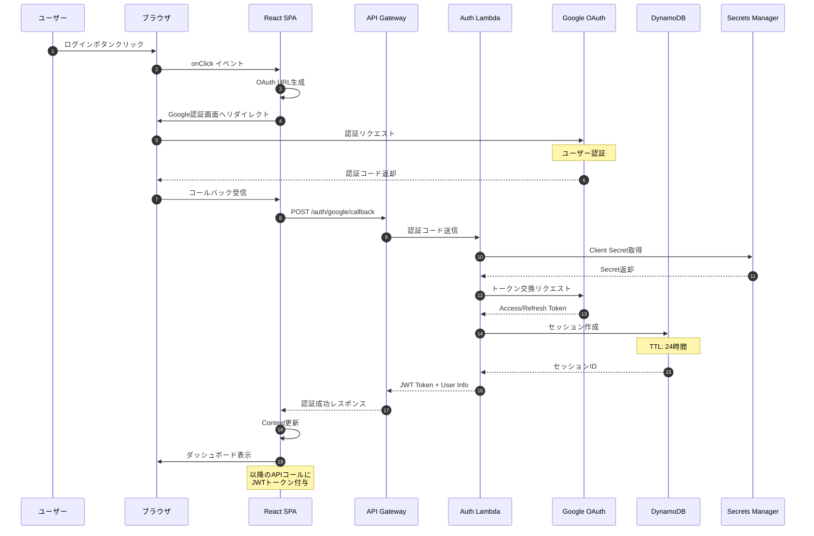
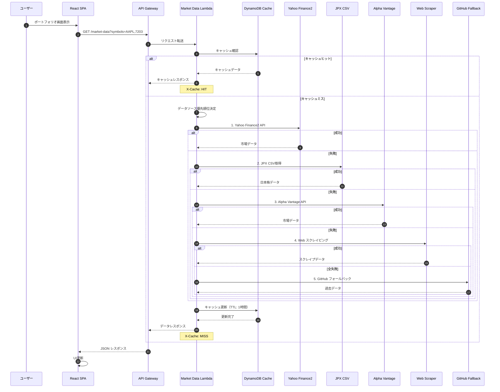
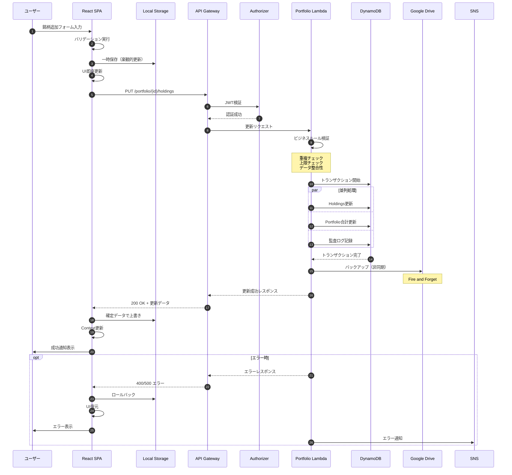
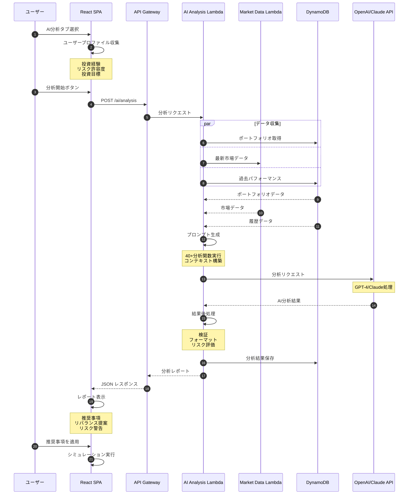
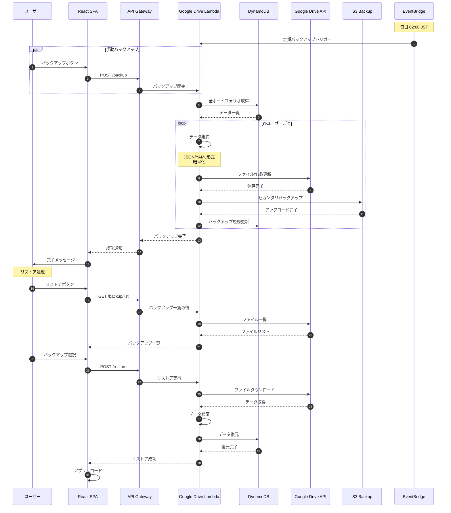
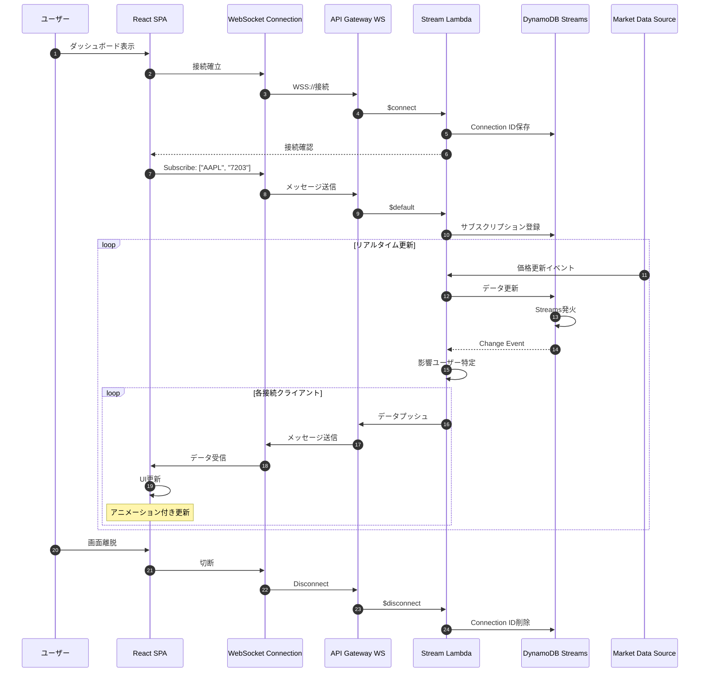
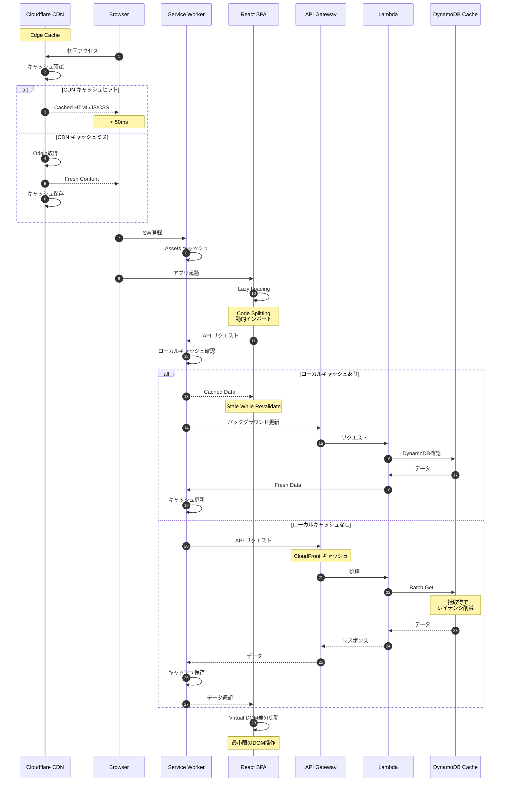

# PortfolioWise シーケンス図集

## 1. 認証フロー（Google OAuth 2.0）



## 2. 市場データ取得フロー（マルチソース戦略）



## 3. ポートフォリオ更新フロー



## 4. AI投資分析フロー



## 5. データ同期・バックアップフロー



## 6. エラーハンドリング・リトライフロー

```mermaid
sequenceDiagram
    autonumber
    
    participant User as ユーザー
    participant React as React SPA
    participant APIGW as API Gateway
    participant Lambda as Lambda Function
    participant CircuitBreaker as Circuit Breaker
    participant ExternalAPI as External API
    participant DynamoDB as DynamoDB
    participant CloudWatch as CloudWatch
    participant SNS as SNS
    
    User->>React: アクション実行
    React->>APIGW: API リクエスト
    APIGW->>Lambda: 処理開始
    
    Lambda->>CircuitBreaker: サービス状態確認
    
    alt Circuit Open
        CircuitBreaker-->>Lambda: サービス利用不可
        Lambda->>DynamoDB: フォールバックデータ取得
        DynamoDB-->>Lambda: キャッシュデータ
        Lambda-->>React: 503 + フォールバックデータ
        Note over React: 警告表示
    else Circuit Closed
        CircuitBreaker-->>Lambda: サービス利用可
        
        loop 最大3回リトライ
            Lambda->>ExternalAPI: API呼び出し
            
            alt 成功
                ExternalAPI-->>Lambda: 正常レスポンス
                Lambda->>CircuitBreaker: 成功記録
                break
            else タイムアウト
                Note over Lambda: 30秒待機
                Lambda->>Lambda: Exponential Backoff
                Note over Lambda: 待機時間: 1s, 2s, 4s
            else 4xx エラー
                ExternalAPI-->>Lambda: Client Error
                Lambda->>CloudWatch: エラーログ
                break リトライ不要
            else 5xx エラー
                ExternalAPI-->>Lambda: Server Error
                Lambda->>CloudWatch: エラーログ
                Lambda->>CircuitBreaker: 失敗カウント増加
            end
        end
        
        alt リトライ成功
            Lambda-->>APIGW: 成功レスポンス
            APIGW-->>React: 200 OK
            React->>User: 結果表示
        else 全リトライ失敗
            Lambda->>CircuitBreaker: Circuit Open設定
            Note over CircuitBreaker: 5分間Open
            
            Lambda->>CloudWatch: 重大エラー記録
            CloudWatch->>SNS: アラート送信
            SNS->>SNS: 管理者通知
            
            Lambda->>DynamoDB: インシデント記録
            Lambda-->>APIGW: 500 エラー
            APIGW-->>React: エラーレスポンス
            React->>React: エラー境界発動
            React->>User: エラーメッセージ
        end
    end
```

## 7. リアルタイムデータ更新フロー（WebSocket検討中）



## 8. パフォーマンス最適化フロー



---

*作成日: 2025-09-05*  
*バージョン: 2.0.0*  
*責任者: アーキテクチャチーム*